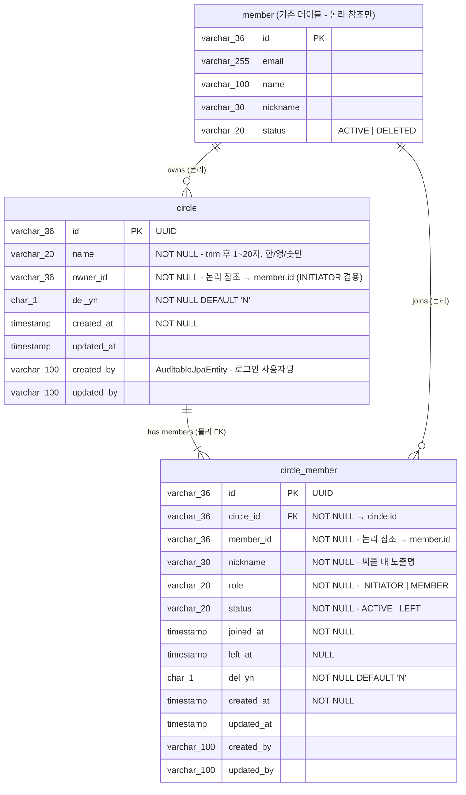

# ERD — 써클(Circle) 도메인

> **기준**: 사이ON 기능명세서 (2026-06-08 v3.1) 써클 요구사항 1.1 ~ 5.1 + `PRD.md`
> **작성일**: 2026-07-01
> **대상 코드베이스**: `com.unicorn.server` (Kotlin + Spring Boot, Hexagonal + DDD)

## 변경 이력

| Rev | 일자 | 내용 |
|---|---|---|
| rev.1 | 2026-07-01 | 초안 |
| **rev.2** | 2026-07-01 | 사용자 결정 반영 — ① CircleName 정규식 `^[가-힣a-zA-Z0-9]+$` 확정 ② 회원 탈퇴 시 CircleMember 조회 필터 (`member.status = 'ACTIVE'`만) ③ `CIRCLE_NAME_INVALID_CHARSET` 예외 코드 신설 |

---

## 설계 의도

- 써클(Circle) = 가족·가까운 지인이 이벤트(생일/기념일/여행 등)를 공동으로 준비하는 그룹 단위
- **Circle**과 **CircleMember**는 별도 Aggregate Root로 분리
  - 구성원 수 증가 시 Circle 로드 부하 방지
  - CircleMember의 lifecycle(JOIN/LEFT)이 Circle의 lifecycle과 독립
- **초대링크는 독립 도메인으로 분리** → `ERD_초대_도메인.md` 참고
- **일정(Schedule) 도메인은 MVP 밖** → 향후 도입. Circle에서 필요한 조회 기능은 `GetSchedulesForCircleInPort` 인터페이스만 정의하고 MVP는 no-op adapter로 stub 처리

### 프로젝트 컨벤션 적용

| 항목 | 결정 | 근거 |
|---|---|---|
| ID 타입 | `varchar(36)` UUID | 기존 `member.id` (UUID)와 논리 참조 호환 |
| 테이블 명명 | 소문자 스네이크, 접두사 없음 | 기존 `member`, `social_account`, `term` 통일 |
| 소프트 삭제 | `del_yn CHAR(1) DEFAULT 'N'` | 사용자 ERD 채택 |
| Audit | `AuditableJpaEntity` (`created_at`, `updated_at`, `created_by varchar(100)`, `updated_by varchar(100)`) | 기존 인프라 재사용 |
| Enum 저장 | `varchar` + `EnumType.STRING` | 기존 `member.status`, `member.role` 등 |
| **CircleName 문자셋** | **`^[가-힣a-zA-Z0-9]+$`** (한/영/숫만) | `Member.nickname`과 동일 정책. rev.2 결정 |
| **회원 탈퇴 시 미노출** | 조회 시 `member.status = 'ACTIVE'` 필터. CircleMember 이력 자체는 유지 | rev.2 결정 |

---

## ERD 다이어그램



---

## `circle` — 써클 기본 정보

| 컬럼 | 타입 | 제약 | 설명 |
|---|---|---|---|
| `id` | `varchar(36)` | PK | 써클 식별자. UUID 문자열 (`MemberId` 컨벤션 재사용) |
| `name` | `varchar(20)` | NOT NULL | 써클 이름. **trim 후 1~20자**, 공백만 불가, **한/영/숫만** (정책 1-4, 1-5, rev.2) |
| `owner_id` | `varchar(36)` | NOT NULL | 생성자 `member.id`. **INITIATOR 겸용**. 논리 참조 → `member.id` |
| `del_yn` | `char(1)` | NOT NULL, DEFAULT `'N'` | 소프트 삭제 여부. `'Y'` \| `'N'` |
| `created_at` | `timestamp` | NOT NULL | Auditing (`AuditableJpaEntity`) |
| `updated_at` | `timestamp` | | Auditing |
| `created_by` | `varchar(100)` | | 로그인 사용자명 (Auditing) |
| `updated_by` | `varchar(100)` | | |

### 인덱스

```sql
CREATE INDEX idx_circle_owner_id ON circle (owner_id);
CREATE INDEX idx_circle_del_yn   ON circle (del_yn);
```

### 비즈니스 규칙 (rev.2)

- **이름 검증** (도메인 VO `CircleName`):
  - trim 후 blank → `CIRCLE_NAME_BLANK` (400)
  - 길이 > 20자 → `CIRCLE_NAME_TOO_LONG` (400)
  - **정규식 `^[가-힣a-zA-Z0-9]+$` 위반 → `CIRCLE_NAME_INVALID_CHARSET` (400)** (rev.2)
- **다중 생성**: 한 Member가 여러 써클을 만들 수 있음 (정책 미제한)
- **소프트 삭제**: `del_yn = 'Y'`로 처리. Hard delete 금지
- **owner_id 겸용**: `owner_id`가 곧 `circle_member` 테이블의 `role = 'INITIATOR'` 사용자. Member 참조는 `owner_id` 단일 필드로 충분

### CircleName VO 예시 코드 (rev.2)

```kotlin
package com.unicorn.server.domain.circle.vo

import com.unicorn.server.common.exception.BusinessException
import com.unicorn.server.domain.circle.exception.CircleErrorCode

@JvmInline
value class CircleName(val value: String) {
    init {
        val trimmed = value.trim()
        if (trimmed.isBlank()) {
            throw BusinessException(CircleErrorCode.CIRCLE_NAME_BLANK)
        }
        if (trimmed.length > MAX_LENGTH) {
            throw BusinessException(CircleErrorCode.CIRCLE_NAME_TOO_LONG)
        }
        if (!CHARSET_PATTERN.matches(trimmed)) {
            throw BusinessException(CircleErrorCode.CIRCLE_NAME_INVALID_CHARSET)
        }
    }

    companion object {
        private const val MAX_LENGTH = 20
        private val CHARSET_PATTERN = Regex("^[가-힣a-zA-Z0-9]+$")
    }
}
```

---

## `circle_member` — 써클 참여자

| 컬럼 | 타입 | 제약 | 설명 |
|---|---|---|---|
| `id` | `varchar(36)` | PK | 멤버십 식별자. UUID |
| `circle_id` | `varchar(36)` | NOT NULL, FK → `circle.id` | 소속 써클 (물리 FK) |
| `member_id` | `varchar(36)` | NOT NULL | 참여 사용자 `member.id` (논리 참조) |
| `nickname` | `varchar(30)` | NOT NULL | 써클 내 노출 닉네임. 최초 참여 시 `member.nickname` 복사 |
| `role` | `varchar(20)` | NOT NULL | `INITIATOR` \| `MEMBER`. Enum String 저장 |
| `status` | `varchar(20)` | NOT NULL | `ACTIVE` \| `LEFT`. Enum String 저장 |
| `joined_at` | `timestamp` | NOT NULL | 참여 완료 시각 |
| `left_at` | `timestamp` | NULL | 탈퇴 시각. MVP 미사용, 스키마만 유지 |
| `del_yn` | `char(1)` | NOT NULL, DEFAULT `'N'` | 소프트 삭제 여부 |
| `created_at` | `timestamp` | NOT NULL | Auditing |
| `updated_at` | `timestamp` | | Auditing |
| `created_by` | `varchar(100)` | | |
| `updated_by` | `varchar(100)` | | |

### 인덱스 / 제약

```sql
CONSTRAINT uq_circle_member_circle_member UNIQUE (circle_id, member_id)
  -- 동일 써클에 동일 사용자 중복 참여 방지

CONSTRAINT fk_circle_member_circle FOREIGN KEY (circle_id) REFERENCES circle (id)
  -- 물리 FK

CREATE INDEX idx_circle_member_member_id ON circle_member (member_id);
CREATE INDEX idx_circle_member_circle_id ON circle_member (circle_id);
```

### 비즈니스 규칙 (rev.2)

- **INITIATOR 탈퇴 불가**: `role = 'INITIATOR'`이면 서비스 레이어에서 탈퇴 차단 → `INITIATOR_CANNOT_LEAVE` (400). 권한 이전 정책 미결 (정책 11.3.2)
- **탈퇴 처리**: `status = 'LEFT'`, `left_at` 세팅. `del_yn`과는 별개 (비즈니스 상태값). MVP 밖
- **중복 참여**: `uq_circle_member_circle_member` UNIQUE 위반 시 → 서비스 레이어에서 `alreadyJoined = true`로 idempotent 성공 처리
- **써클 내 닉네임**: 최초 참여 시 `member.nickname`을 그대로 복사. MVP는 편집 불가
- **회원 탈퇴 시 조회 미노출 (rev.2)**:
  - CircleMember 자체는 그대로 유지 (감사 목적, 하드 삭제/상태 전이 없음)
  - **조회 시점**에 `member.status = 'ACTIVE'`인 회원의 CircleMember만 반환
  - `MemberOutPort.findAllActiveById(memberIds)` 등 활성 회원 조회 API를 활용해 필터링
  - 이 정책은 홈 조회 · 구성원 목록 조회 · `canInvite` 카운트 등 **모든 조회 경로**에 일관되게 적용

### 회원 탈퇴 필터 예시 코드 (rev.2)

```kotlin
fun getVisibleMembers(circleId: CircleId): List<CircleMemberView> {
    val allMembers = circleMemberOutPort.findAllActiveByCircleId(circleId)
    val memberIds = allMembers.map { it.memberId }

    // rev.2: member.status = 'ACTIVE'인 사용자만 통과
    val activeMemberIds = memberOutPort.findAllActiveById(memberIds)
        .map { it.id }
        .toSet()

    return allMembers
        .filter { it.memberId in activeMemberIds }
        .map(::toView)
}
```

---

## FK 구조 요약

| 참조 방향 | 유형 | 비고 |
|---|---|---|
| `circle_member.circle_id → circle.id` | **물리 FK** | 써클 소프트 삭제(`del_yn='Y'`) 시 멤버 처리 필요 (일괄 `del_yn='Y'`) |
| `circle.owner_id → member.id` | 논리 참조 | FK 미설정 (기존 `member.id` UUID) |
| `circle_member.member_id → member.id` | 논리 참조 | 동일. **조회 시 `member.status = 'ACTIVE'` 필터 적용** (rev.2) |
| `circle.created_by → member` | 논리 (username 문자열) | Auditing 정책 |
| `circle_member.created_by → member` | 동일 | |

---

## 도메인 이벤트 (참고)

`Circle`/`CircleMember` 애그리게이트 변경 시 발행되는 이벤트.

| Event | 발행 시점 | 페이로드 |
|---|---|---|
| `CircleCreatedEvent` | 써클 생성 완료 | `circleId, ownerId, occurredAt` |
| `CircleMemberJoinedEvent` | 신규 참여자 등록 (초대 수락 or 생성자 자동 등록) | `circleId, memberId, role, occurredAt` |
| `CircleMemberLeftEvent` | 구성원 탈퇴 (**MVP 밖**) | `circleId, memberId, occurredAt` |

---

## 상태 전이 다이어그램

### Circle

```
    [POST /circles]
         │
         ▼
      ACTIVE (del_yn='N')
         │
         │  softDelete()  (MVP 밖)
         ▼
      DELETED (del_yn='Y')
```

### CircleMember

```
    [초대 수락 or 생성자 자동 등록]
         │
         ▼
      ACTIVE ─────── leave() ──────▶ LEFT (left_at 세팅, MVP 밖)
         ▲
         │ INITIATOR 는 leave() 시 INITIATOR_CANNOT_LEAVE 예외

    rev.2: 회원 탈퇴 시 CircleMember 자체는 상태 전이 없음.
           조회 시점에 member.status = 'ACTIVE' 필터로만 처리.
```

---

## 예외 코드 (rev.2)

| Code | HTTP | Message |
|---|---|---|
| `CIRCLE_NAME_BLANK` | 400 | 써클 이름을 입력해주세요. |
| `CIRCLE_NAME_TOO_LONG` | 400 | 20자 이내로 입력해주세요. |
| **`CIRCLE_NAME_INVALID_CHARSET`** (rev.2 신설) | 400 | 한글, 영문, 숫자만 사용할 수 있어요. |
| `CIRCLE_NICKNAME_INVALID` | 400 | 유효하지 않은 닉네임입니다. |
| `CIRCLE_NOT_FOUND` | 404 | 써클을 찾을 수 없습니다. |
| `CIRCLE_ACCESS_DENIED` | 403 | 써클에 접근 권한이 없습니다. |
| `INITIATOR_CANNOT_LEAVE` | 400 | 생성자는 탈퇴할 수 없습니다. (MVP 밖) |

> **rev.2 삭제**: `DUPLICATE_CIRCLE_MEMBER` — 중복 참여는 예외가 아닌 `alreadyJoined = true` idempotent 응답으로 처리.

---

## Flyway 마이그레이션 스니펫

파일: `src/main/resources/db/migration/V1.0.1.0__init_circle_schema.sql`

```sql
-- ============================================================
-- Circle 도메인
-- ============================================================
create table circle (
    id           varchar(36)  not null,
    name         varchar(20)  not null,
    owner_id     varchar(36)  not null,
    del_yn       char(1)      not null default 'N',
    created_at   timestamp    not null,
    updated_at   timestamp,
    created_by   varchar(100),
    updated_by   varchar(100),
    constraint pk_circle primary key (id)
);
create index idx_circle_owner_id on circle (owner_id);
create index idx_circle_del_yn   on circle (del_yn);

create table circle_member (
    id           varchar(36)  not null,
    circle_id    varchar(36)  not null,
    member_id    varchar(36)  not null,
    nickname     varchar(30)  not null,
    role         varchar(20)  not null,
    status       varchar(20)  not null,
    joined_at    timestamp    not null,
    left_at      timestamp,
    del_yn       char(1)      not null default 'N',
    created_at   timestamp    not null,
    updated_at   timestamp,
    created_by   varchar(100),
    updated_by   varchar(100),
    constraint pk_circle_member primary key (id),
    constraint uq_circle_member_circle_member unique (circle_id, member_id),
    constraint fk_circle_member_circle foreign key (circle_id) references circle (id)
);
create index idx_circle_member_member_id on circle_member (member_id);
create index idx_circle_member_circle_id on circle_member (circle_id);
```

---

## 미결 사항 (rev.2)

**rev.2에서 확정된 항목은 제거**되었고, 남은 항목만 명시.

| 미결 항목 | 현재 설계 처리 방식 |
|---|---|
| 생성자 탈퇴 권한 이전 정책 (정책 11.3.2) | `role = 'INITIATOR'`이면 서비스 레이어에서 차단. 권한 이전 API 미구현 |
| CircleMember.nickname 편집 정책 (Open Q1) | MVP: 최초 참여 시 `member.nickname` 복사, 편집 불가 |
| 써클 자체 소프트 삭제 시 하위 CircleMember 처리 (Open Q9) | MVP 밖. 향후 소프트 삭제 API 도입 시 트리거 or 서비스 레이어에서 일괄 `del_yn='Y'` |

> **rev.2에서 확정 (제거된 미결 사항)**:
> - CircleName 문자셋 → **`^[가-힣a-zA-Z0-9]+$`** (한/영/숫만)
> - 회원 탈퇴 시 CircleMember 노출 → **조회 필터 (`member.status = 'ACTIVE'`)**, 상태 전이 없음
> - 이미 참여한 사용자 재수락 → **`alreadyJoined = true` idempotent 성공**

---

## 관련 문서

- [PRD.md](./PRD.md) — 도메인 아키텍처, API 명세, 전체 흐름
- [ERD_초대_도메인.md](./ERD_초대_도메인.md) — 초대링크 도메인 (독립 도메인, 다중 사용, rev.2)
