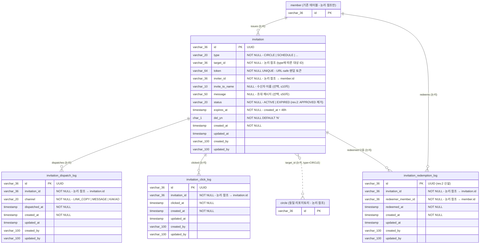

# ERD — 초대(Invitation) 도메인

> **기준**: 사이ON 기능명세서 (2026-06-08 v3.1) 초대 요구사항 3.1 ~ 4.3, 지표 3-5 + `PRD.md`
> **작성일**: 2026-07-01
> **대상 코드베이스**: `com.unicorn.server` (Kotlin + Spring Boot, Hexagonal + DDD)

## 변경 이력

| Rev | 일자 | 내용 |
|---|---|---|
| rev.1 | 2026-07-01 | 초안 (단일 사용 정책 기반) |
| **rev.2** | 2026-07-01 | 사용자 결정 반영 — **다중 사용 정책**으로 스키마 재설계: `approved_by`/`approved_at` 컬럼 **제거**, `invitation_redemption_log` 테이블 **신설**, `InvitationStatus`에서 `APPROVED` **제거**, 자기 자신 초대 불가 방어 로직 추가 |

---

## 설계 의도

- 초대는 **써클(Circle)에 종속되지 않는 독립 도메인**으로 분리
- `type` 값 교체만으로 **써클 초대 · 일정 초대 · 향후 신규 기능 초대에 재활용** 가능 (사용자 ERD 원안 계승)
- 초대 링크는 **48시간 TTL 휘발성 데이터** → 이후 **Redis 이전 예정** (물리 FK 미설정)
- 정책 3-5에 명시된 **채널별 발송 지표 / 클릭 지표 / 참여 지표**를 도메인 이벤트 + 별도 로그 테이블 조합으로 수집
- **하나의 초대장 → 다중 채널 발송 가능** (링크복사 후 카톡으로 재전송) → `channel`은 발송 로그 테이블에 위치
- **rev.2: 하나의 초대장 → 다중 사용자 수락 가능** — 링크가 살아있는 동안 여러 사람이 순차 수락. `approved_by/approved_at` 단수 필드로는 표현 불가하므로 별도 `invitation_redemption_log` 테이블로 이력 축적

### 프로젝트 컨벤션 적용

| 항목 | 결정 | 근거 |
|---|---|---|
| ID 타입 | `varchar(36)` UUID | 기존 `member.id`와 논리 참조 호환 |
| 테이블 명명 | 소문자 스네이크, 접두사 없음 | 기존 프로젝트 통일 |
| 소프트 삭제 | `del_yn CHAR(1) DEFAULT 'N'` | 사용자 ERD 채택 |
| Audit | `AuditableJpaEntity` | 기존 인프라 재사용 |
| Enum 저장 | `varchar` + `EnumType.STRING` | 기존 컨벤션 |
| **자기 자신 초대** | **불가** — 수락 시점에 `inviter_id == redeemer_member_id` 검증 (rev.2) | 사용자 결정 ① |
| **수락 방식** | **다중 사용** — 만료 전까지 여러 사용자 순차 수락 가능 (rev.2) | 사용자 결정 ⑥ |

### 사용자 원본 ERD 대비 확장 지점

| 항목 | 사용자 원본 | 본 문서 (rev.2) | 사유 |
|---|---|---|---|
| 채널(`channel`) 필드 | `invitation`에 없음 | 별도 `invitation_dispatch_log` 테이블 | 채널별 발송 지표, 다중 채널 재발송 지원 |
| 클릭 이력 | 없음 | 별도 `invitation_click_log` 테이블 | 정책 3-5의 클릭 지표. 다회 클릭 가능성 반영 |
| **수락 이력** | **`approved_by` / `approved_at` 단수 필드** | **별도 `invitation_redemption_log` 테이블 (rev.2)** | **다중 사용 정책**상 단수 필드로 표현 불가 |
| **status 값** | `ACTIVE` \| `EXPIRED` \| `APPROVED` | **`ACTIVE` \| `EXPIRED` (rev.2)** | 다중 사용 시 `APPROVED` 개념 무의미 |
| `target_id` 타입 | BIGINT | `varchar(36)` | UUID 통일 결정 |
| `invite_token` 컬럼명 | `invite_token` | `token` | 도메인 언어 간결화 |
| `approved_by` 참조 대상 | `TB_USER.user_id` | (제거됨) | rev.2 컬럼 자체 제거 |

---

## ERD 다이어그램 (rev.2)



---

## `invitation` — 초대링크 (rev.2)

| 컬럼 | 타입 | 제약 | 설명 |
|---|---|---|---|
| `id` | `varchar(36)` | PK | 초대 식별자. UUID |
| `type` | `varchar(20)` | NOT NULL | 초대 유형. 아래 코드 정의 참고 |
| `target_id` | `varchar(36)` | NOT NULL | 초대 대상 ID. `type`에 따라 참조 대상 다름. **논리 참조** |
| `token` | `varchar(64)` | NOT NULL, UNIQUE | URL-safe 랜덤 토큰. 32~64자 (SecureRandom Base62) |
| `inviter_id` | `varchar(36)` | NOT NULL | 발급자 `member.id`. 논리 참조 |
| `invite_to_name` | `varchar(10)` | NULL | 수신자 이름 (선택). 값 있을 때 1~10자 |
| `message` | `varchar(50)` | NULL | 초대 메시지 (선택). 값 있을 때 1~50자 |
| `status` | `varchar(20)` | NOT NULL | **`ACTIVE` \| `EXPIRED`** (rev.2: `APPROVED` 제거) |
| `expires_at` | `timestamp` | NOT NULL | `created_at + 48시간` |
| `del_yn` | `char(1)` | NOT NULL, DEFAULT `'N'` | 소프트 삭제 여부 |
| `created_at` | `timestamp` | NOT NULL | Auditing (발급 시각) |
| `updated_at` | `timestamp` | | Auditing |
| `created_by` | `varchar(100)` | | 로그인 사용자명 (Auditing) |
| `updated_by` | `varchar(100)` | | |

> **rev.2 제거된 컬럼**: `approved_by`, `approved_at` — 다중 사용 정책 반영으로 수락 이력은 `invitation_redemption_log`로 이관.

### 인덱스 / 제약

```sql
CONSTRAINT uq_invitation_token UNIQUE (token)

CREATE INDEX idx_invitation_type_target_id    ON invitation (type, target_id);
CREATE INDEX idx_invitation_inviter_id        ON invitation (inviter_id);
CREATE INDEX idx_invitation_status_expires_at ON invitation (status, expires_at);
```

> **rev.2 제거된 인덱스**: `idx_invitation_approved_by` — 컬럼 제거에 따라 삭제.

---

## `invitation_dispatch_log` — 채널별 발송 로그

**존재 이유**: 정책 3-5의 채널별 발송 지표 수집. 하나의 초대장이 여러 채널로 재발송될 수 있으므로 별도 테이블로 분리.

| 컬럼 | 타입 | 제약 | 설명 |
|---|---|---|---|
| `id` | `varchar(36)` | PK | UUID |
| `invitation_id` | `varchar(36)` | NOT NULL | 대상 초대장 `invitation.id`. 논리 참조 |
| `channel` | `varchar(20)` | NOT NULL | `LINK_COPY` \| `MESSAGE` \| `KAKAO`. Enum String |
| `dispatched_at` | `timestamp` | NOT NULL | 발송 채널 로깅 시각 |
| `created_at` | `timestamp` | NOT NULL | Auditing |
| `updated_at` | `timestamp` | | Auditing |
| `created_by` | `varchar(100)` | | |
| `updated_by` | `varchar(100)` | | |

### 인덱스

```sql
CREATE INDEX idx_invitation_dispatch_log_invitation_id ON invitation_dispatch_log (invitation_id);
CREATE INDEX idx_invitation_dispatch_log_channel        ON invitation_dispatch_log (channel);
```

### 비즈니스 규칙

- 초대장 하나에 대해 **여러 채널로 여러 번 발송 가능**
- 각 채널 발송 시마다 별도 row 삽입
- 발송 이벤트: `InvitationDispatchedEvent` 발행 → EventListener가 이 테이블에 저장

---

## `invitation_click_log` — 클릭 로그

**존재 이유**: 정책 3-5의 클릭 지표 수집. 다회 클릭 가능성 반영.

**클릭의 정의 (rev.2 확정)**: 초대 링크로 앱에 진입해서 수락 화면(`GET /api/v1/invitations/by-token/{token}`)을 조회한 순간이 곧 클릭. 별도의 트래킹 픽셀이나 별도 API는 없음.

| 컬럼 | 타입 | 제약 | 설명 |
|---|---|---|---|
| `id` | `varchar(36)` | PK | UUID |
| `invitation_id` | `varchar(36)` | NOT NULL | 대상 초대장 `invitation.id`. 논리 참조 |
| `clicked_at` | `timestamp` | NOT NULL | 클릭 시각 |
| `created_at` | `timestamp` | NOT NULL | Auditing |
| `updated_at` | `timestamp` | | Auditing |
| `created_by` | `varchar(100)` | | |
| `updated_by` | `varchar(100)` | | |

### 인덱스

```sql
CREATE INDEX idx_invitation_click_log_invitation_id ON invitation_click_log (invitation_id);
```

### 비즈니스 규칙

- `GET /api/v1/invitations/by-token/{token}` 호출 시 부수 효과로 자동 기록
- 미로그인 상태에서도 기록 가능 (`created_by`는 null 허용)

---

## `invitation_redemption_log` — 수락 이력 로그 (rev.2 신설)

**존재 이유**: **다중 사용 정책**을 표현하기 위한 핵심 테이블. 하나의 초대장에 대해 여러 사용자가 순차 수락 가능하므로, 수락 이력을 별도 테이블에 축적한다. 사용자 원본 ERD의 `approved_by/approved_at` 컬럼을 대체한다.

| 컬럼 | 타입 | 제약 | 설명 |
|---|---|---|---|
| `id` | `varchar(36)` | PK | UUID |
| `invitation_id` | `varchar(36)` | NOT NULL | 대상 초대장 `invitation.id`. 논리 참조 |
| `redeemer_member_id` | `varchar(36)` | NOT NULL | 수락자 `member.id`. 논리 참조 |
| `redeemed_at` | `timestamp` | NOT NULL | 수락 시각 |
| `created_at` | `timestamp` | NOT NULL | Auditing |
| `updated_at` | `timestamp` | | Auditing |
| `created_by` | `varchar(100)` | | |
| `updated_by` | `varchar(100)` | | |

### 인덱스 / 제약

```sql
CONSTRAINT uq_invitation_redemption_invitation_redeemer
  UNIQUE (invitation_id, redeemer_member_id)
  -- 같은 사용자가 같은 초대를 여러 번 "수락"하지 못하도록 방어 (idempotency)

CREATE INDEX idx_invitation_redemption_log_invitation_id
  ON invitation_redemption_log (invitation_id);
CREATE INDEX idx_invitation_redemption_log_redeemer
  ON invitation_redemption_log (redeemer_member_id);
```

### 비즈니스 규칙

- 초대장 하나에 대해 **여러 사용자가 순차 수락 가능**. 각 수락마다 별도 row 삽입
- 동일 사용자의 재수락 시도는 UNIQUE 제약으로 방어 → 서비스 레이어에서 `alreadyJoined = true` idempotent 응답
- 수락 이벤트: `InvitationRedeemedEvent` 발행 → EventListener가 이 테이블에 저장
- **자기 자신 수락 불가**: 서비스 레이어에서 `invitation.inviter_id == redeemer_member_id` 검증 → `INVITATION_SELF_APPROVAL_FORBIDDEN` (403)

---

## `type` 코드 정의

| type | 대상 테이블 | `target_id` 의미 | 비고 |
|---|---|---|---|
| `CIRCLE` | `circle` | `circle.id` | **MVP** |
| `SCHEDULE` | `schedule` | `schedule.id` | 이후 확장 (스키마 여지만) |

> 신규 기능 추가 시 코드 정의만 확장하면 `invitation` 재활용 가능.

---

## `status` 코드 정의 (rev.2)

| status | 의미 | 전이 조건 |
|---|---|---|
| `ACTIVE` | 유효한 초대링크 | 생성 시 기본값. **다중 수락 중에도 유지** |
| `EXPIRED` | 만료된 초대링크 | `NOW() > expires_at` (배치 or 조회 시점 lazy 판정) |

> **rev.2 삭제**: `APPROVED` — 다중 사용 정책상 "수락 완료"는 초대장의 종료 상태가 아니라 개별 수락 이벤트일 뿐이므로 무의미. 수락 이력은 `invitation_redemption_log`에서만 관리.

---

## `channel` 코드 정의 (dispatch_log)

| channel | 사용자 액션 | 정책 근거 |
|---|---|---|
| `LINK_COPY` | "링크 복사" 탭 → 클립보드 복사 | 정책 3-2 |
| `MESSAGE` | "메시지 전송" 탭 → OS 메시지 앱 전환 | 정책 3-3 |
| `KAKAO` | "카카오톡 전송" 탭 → 카카오 공유 화면 전환 | 정책 3-4 |

---

## 비즈니스 규칙 (rev.2 재정리)

### 발급

- `expires_at = created_at + INTERVAL 48 HOUR`
- 초기 `status = 'ACTIVE'`
- `token`은 URL-safe 랜덤 (SecureRandom Base62, 32자 이상)
- 발급자는 대상 리소스(예: 써클)의 활성 구성원이어야 함 → 서비스 레이어에서 검증
- 발급 시 `InvitationIssuedEvent` 발행

### 발송

- 초대장 발급은 **링크 하나만 생성**. 발송 채널은 사용자가 UI에서 개별 선택
- 각 채널 선택 시 `POST /api/v1/invitations/{invitationId}/dispatches` 별도 호출 → `invitation_dispatch_log` 삽입
- 동일 초대장에 대해 여러 채널로 여러 번 발송 가능

### 클릭 (rev.2 확정)

- 클릭 = **초대 링크로 진입해 수락 화면 조회**한 순간
- `GET /api/v1/invitations/by-token/{token}` 조회 시 자동으로 `invitation_click_log` 삽입
- 미로그인 상태에서도 기록 가능

### 수락 (rev.2 - 다중 사용)

- 로그인 상태에서만 가능 (`POST /api/v1/invitations/by-token/{token}/accept`, JWT 필수)
- `status = 'ACTIVE'` AND `NOW() <= expires_at`일 때만 수락 성공
- **자기 자신 초대 방어**: `invitation.inviter_id == redeemer_member_id`이면 `INVITATION_SELF_APPROVAL_FORBIDDEN` (403)
- **다중 사용**: 만료 전까지 여러 사용자가 순차 수락 가능. Invitation의 `status`는 그대로 `ACTIVE` 유지 (전이 없음)
- 수락 성공 시:
  - **동일 트랜잭션 안에서** `CircleMember` 생성 (Application Service에서 오케스트레이션)
  - `invitation_redemption_log`에 row 삽입
  - `InvitationRedeemedEvent`, `CircleMemberJoinedEvent` 순차 발행
- 이미 참여한 사용자의 재수락 시도 → `alreadyJoined = true`로 idempotent 성공 응답 (신규 CircleMember 생성 및 redemption 로그 삽입 스킵)
- **동일 사용자의 재수락 시도**는 `uq_invitation_redemption_invitation_redeemer` UNIQUE 제약으로 방어됨 (실질적으로는 위의 `alreadyJoined` 로직에서 걸러짐)

### 만료

- **조회 시점 lazy 판정**: `NOW() > expires_at`이면 응답 시 `EXPIRED` 처리 (`status` 컬럼 값과 무관하게)
- **배치 만료 처리** (MVP 이후 or 야간 1회): `status = 'ACTIVE'` AND `expires_at < NOW()` → `status = 'EXPIRED'` UPDATE
- 만료 이벤트 `InvitationExpiredEvent` 발행 (배치에서만)

### 재발급

- 동일 `target_id` + `type` 조합으로 여러 번 발급 가능
- 이전 링크는 그대로 유효 (병존 허용). 각 링크는 독립적으로 만료·수락 처리

### 소프트 삭제

- `del_yn = 'Y'`로 처리. Hard delete 금지
- MVP 스코프에서는 삭제 API 없음

---

## FK 구조 요약

| 참조 방향 | 유형 | 비고 |
|---|---|---|
| `invitation.target_id → circle.id` (or `schedule.id`) | **논리 참조** | `type`에 따라 참조 대상이 달라지므로 물리 FK 미설정 |
| `invitation.inviter_id → member.id` | 논리 참조 | |
| `invitation_dispatch_log.invitation_id → invitation.id` | 논리 참조 | 향후 Redis 이전 대비 |
| `invitation_click_log.invitation_id → invitation.id` | 논리 참조 | 동일 |
| **`invitation_redemption_log.invitation_id → invitation.id`** | **논리 참조 (rev.2)** | 향후 Redis 이전 대비 |
| **`invitation_redemption_log.redeemer_member_id → member.id`** | **논리 참조 (rev.2)** | |
| `invitation.created_by → member` | 논리 (username 문자열) | Auditing |

> 모든 FK가 논리 참조인 이유는 **Invitation 도메인의 Redis 이전을 위한 격리** 때문. RDB 유지 시에도 관계 무결성은 서비스 레이어에서 방어.

---

## 도메인 이벤트 (rev.2)

| Event | 발행 시점 | 페이로드 | 후속 처리 |
|---|---|---|---|
| `InvitationIssuedEvent` | 초대장 생성 | `invitationId, type, targetId, inviterId, occurredAt` | (선택) 지표 대시보드 카운트 |
| `InvitationDispatchedEvent` | 채널별 발송 API 호출 시 | `invitationId, channel, dispatchedAt` | `invitation_dispatch_log` 저장 |
| `InvitationClickedEvent` | 링크 조회 시 | `invitationId, clickedAt` | `invitation_click_log` 저장 |
| **`InvitationRedeemedEvent`** (rev.2) | **수락 성공 시 (매 수락마다)** | `invitationId, type, targetId, redeemerMemberId, occurredAt` | `invitation_redemption_log` 저장, 전환율 지표 카운트, 후속 도메인 알림 |
| `InvitationExpiredEvent` | 배치 만료 처리 시 | `invitationId, occurredAt` | (선택) 만료 통계 |

> **rev.2 대체**: 기존 `InvitationApprovedEvent`는 이름을 `InvitationRedeemedEvent`로 변경. 다중 사용 정책상 "승인(approve)"보다는 "수락(redeem)" 표현이 정확.

---

## 상태 전이 다이어그램 (rev.2)

```
     [POST /invitations]
              │
              ▼
         ┌─────────┐
         │ ACTIVE  │────── 여러 사용자 순차 수락 가능
         └────┬────┘        (Invitation 상태는 그대로 ACTIVE 유지,
              │              수락 이력은 invitation_redemption_log에 축적)
              │
          (expire)
              │
              ▼
         ┌──────────┐
         │ EXPIRED  │
         └──────────┘

  ACTIVE 만 유효 상태.
  조회 시점 NOW() > expires_at → EXPIRED로 응답 (lazy).

  rev.2: APPROVED 상태 제거. 다중 사용 정책상 종료 상태 없음.
```

---

## 예외 코드 (rev.2)

| Code | HTTP | Message |
|---|---|---|
| `INVITATION_TARGET_INVALID` | 400 | 잘못된 초대 대상입니다. |
| `INVITATION_NOT_AUTHORIZED` | 403 | 초대장을 발급할 권한이 없습니다. |
| `INVITATION_NOT_FOUND` | 404 | 초대장을 찾을 수 없습니다. |
| `INVITATION_EXPIRED` | 410 | 만료된 초대장이에요. 초대자에게 다시 요청해주세요. |
| **`INVITATION_SELF_APPROVAL_FORBIDDEN`** (rev.2 신설) | 403 | 자신이 발급한 초대장은 수락할 수 없습니다. |
| `INVITE_TO_NAME_INVALID` | 400 | 수신자 이름 형식이 올바르지 않습니다. |
| `INVITE_MESSAGE_INVALID` | 400 | 초대 메시지 형식이 올바르지 않습니다. |

> **rev.2 삭제**: `INVITATION_ALREADY_APPROVED` — 다중 사용 정책상 개념 자체가 무의미.

---

## Flyway 마이그레이션 스니펫 (rev.2)

파일: `src/main/resources/db/migration/V1.0.1.1__init_invitation_schema.sql`

```sql
-- ============================================================
-- Invitation 도메인 (독립, 다형 초대, 다중 사용 - rev.2)
-- ============================================================
create table invitation (
    id               varchar(36)  not null,
    type             varchar(20)  not null,
    target_id        varchar(36)  not null,
    token            varchar(64)  not null,
    inviter_id       varchar(36)  not null,
    invite_to_name   varchar(10),
    message          varchar(50),
    status           varchar(20)  not null,        -- ACTIVE | EXPIRED  (rev.2: APPROVED 제거)
    expires_at       timestamp    not null,
    del_yn           char(1)      not null default 'N',
    created_at       timestamp    not null,
    updated_at       timestamp,
    created_by       varchar(100),
    updated_by       varchar(100),
    constraint pk_invitation primary key (id),
    constraint uq_invitation_token unique (token)
);
create index idx_invitation_type_target_id     on invitation (type, target_id);
create index idx_invitation_inviter_id         on invitation (inviter_id);
create index idx_invitation_status_expires_at  on invitation (status, expires_at);

-- 채널별 발송 로깅
create table invitation_dispatch_log (
    id             varchar(36)  not null,
    invitation_id  varchar(36)  not null,
    channel        varchar(20)  not null,
    dispatched_at  timestamp    not null,
    created_at     timestamp    not null,
    updated_at     timestamp,
    created_by     varchar(100),
    updated_by     varchar(100),
    constraint pk_invitation_dispatch_log primary key (id)
);
create index idx_invitation_dispatch_log_invitation_id on invitation_dispatch_log (invitation_id);
create index idx_invitation_dispatch_log_channel      on invitation_dispatch_log (channel);

-- 클릭 로깅
create table invitation_click_log (
    id             varchar(36)  not null,
    invitation_id  varchar(36)  not null,
    clicked_at     timestamp    not null,
    created_at     timestamp    not null,
    updated_at     timestamp,
    created_by     varchar(100),
    updated_by     varchar(100),
    constraint pk_invitation_click_log primary key (id)
);
create index idx_invitation_click_log_invitation_id on invitation_click_log (invitation_id);

-- 수락 이력 로깅 (rev.2 신설, 다중 사용 지원)
create table invitation_redemption_log (
    id                    varchar(36)  not null,
    invitation_id         varchar(36)  not null,
    redeemer_member_id    varchar(36)  not null,
    redeemed_at           timestamp    not null,
    created_at            timestamp    not null,
    updated_at            timestamp,
    created_by            varchar(100),
    updated_by            varchar(100),
    constraint pk_invitation_redemption_log primary key (id),
    constraint uq_invitation_redemption_invitation_redeemer unique (invitation_id, redeemer_member_id)
);
create index idx_invitation_redemption_log_invitation_id on invitation_redemption_log (invitation_id);
create index idx_invitation_redemption_log_redeemer      on invitation_redemption_log (redeemer_member_id);
```

---

## Redis 이전 시 고려사항 (rev.2 조정)

Invitation 도메인은 **48시간 TTL 휘발성 데이터**이므로 Redis가 자연스러운 저장소이다. 향후 이전 시 다음과 같이 매핑한다.

| 항목 | RDB (현재 MVP) | Redis (이전 후) |
|---|---|---|
| **저장 키** | `invitation.id` (PK) | `invitation:{type}:{token}` |
| **TTL 관리** | `expires_at` 컬럼 + 조회 시 lazy 판정 | Redis `EXPIREAT` 자동 만료 |
| **`status` 관리** | `ACTIVE` \| `EXPIRED` 컬럼 | TTL 만료 = EXPIRED (자동 소멸) |
| **스키마** | `invitation` 테이블 (13개 컬럼) | Hash 자료구조: `type`, `target_id`, `inviter_id`, `invite_to_name`, `message`, `created_at` |
| **UNIQUE(token)** | DB 제약 | Redis 키의 자연 UNIQUE |
| **지표 로깅** | `invitation_dispatch_log`, `invitation_click_log`, `invitation_redemption_log` (RDB 유지) | **Redis에 이전하지 않음** (지표는 영구 보존 필요) |
| **다중 사용 이력** | `invitation_redemption_log` | 그대로 RDB (rev.2 반영) |

### 이전 시 유지되어야 할 것

- `InvitationOutPort` 인터페이스는 변경 없음 (Adapter만 `InvitationRedisAdapter`로 교체)
- 도메인 이벤트 발행 흐름은 그대로 유지
- **모든 로그 테이블(3개)은 RDB에 계속 저장** — 지표 영구 보존 목적

### 이전 시 유의할 것

- 배치 만료 처리(`InvitationExpiredEvent` 발행)는 Redis Keyspace Notification 사용 필요
- 관측성(모니터링)을 위해 만료 이벤트가 손실되지 않도록 발행 실패 시 재시도 로직 필요
- 다중 사용 정책상 Redis 키 자체는 만료될 때까지 삭제하지 않음 (수락되어도 유지)

---

## 미결 사항 (rev.2)

**rev.2에서 확정된 항목은 제거**되었고, 남은 항목만 명시.

| 미결 항목 | 현재 설계 처리 방식 |
|---|---|
| 배치 만료 처리 주기 (Open Q7) | 조회 시점 lazy 판정 + 야간 1회 배치 병행 |
| `type = SCHEDULE`의 target validation (Open Q8) | MVP 밖. 스키마 확장 여지만 남김 |
| 토큰 길이 (Open Q11) | 32자 Base62 SecureRandom (예측 불가능성 충분) |
| 미로그인 초대 링크 진입 UX (Open Q12) | 프론트가 로그인/온보딩 후 재수락 API 호출. `POST /accept`는 JWT 없으면 401 |
| 만료된 초대장 및 로그 데이터 보존 기간 | 정책 미결. 별도 데이터 보존 정책 필요 |
| Invitation 재발급 시 이전 링크의 자동 만료 | 두 링크 공존 허용, 각 링크는 독립적으로 lifecycle 관리 |

> **rev.2에서 확정 (제거된 미결 사항)**:
> - Q4 초대장 단일 사용 vs 다중 사용 → **다중 사용**
> - Q5 이미 참여한 사용자의 링크 재진입 → **`alreadyJoined = true` idempotent**
> - 자기 자신 초대 → **불가** (수락 시점 검증)

---

## 관련 문서

- [PRD.md](./PRD.md) — 도메인 아키텍처, API 명세, 전체 흐름, 초대 수락 오케스트레이션 (rev.2 다중 사용)
- [ERD_써클_도메인.md](./ERD_써클_도메인.md) — 써클 도메인 (Circle, CircleMember)
