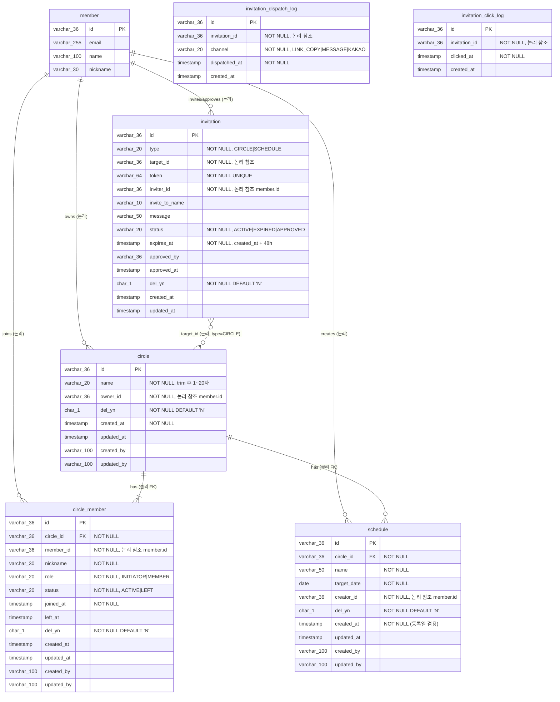

# PRD — 써클(Circle) 도메인

> **기준 문서**: 사이ON 기능명세서 (2026-06-08 v3.1) 써클 요구사항 1.1 ~ 5.1
> **작성일**: 2026-07-01
> **대상 코드베이스**: `com.unicorn.server` (Kotlin 2.x + Spring Boot 3.x, Hexagonal + DDD)
> **선행 도메인**: `member`, `term` (구현 완료)

---

## 목차

1. [개요](#1-개요)
2. [스코프](#2-스코프)
3. [사용자 시나리오](#3-사용자-시나리오)
4. [기능 요구사항 (FR)](#4-기능-요구사항-fr)
5. [비기능 요구사항 (NFR)](#5-비기능-요구사항-nfr)
6. [도메인 아키텍처](#6-도메인-아키텍처)
7. [ERD (물리 스키마)](#7-erd-물리-스키마)
8. [API 명세](#8-api-명세)
9. [상태 전이 다이어그램](#9-상태-전이-다이어그램)
10. [검증 규칙 요약](#10-검증-규칙-요약)
11. [지표 및 로깅](#11-지표-및-로깅)
12. [예외 코드](#12-예외-코드)
13. [개발 순서 로드맵](#13-개발-순서-로드맵)
14. [Open Questions / Assumptions](#14-open-questions--assumptions)

---

## 1. 개요

**써클(Circle)** 은 가족·가까운 지인이 함께 준비할 이벤트(생일, 기념일, 여행 등)를 공동으로 관리하는 그룹 단위이다. 사용자는 써클을 만들고, 초대링크로 구성원을 모으며, 일정을 등록하여 준비 상태를 공유한다.

이 PRD는 **정책 기능명세서를 도메인 언어로 재해석**하여, `member` 도메인 스타일의 Hexagonal 아키텍처 위에서 **Circle / Invitation / Schedule** 세 개의 바운디드 컨텍스트로 분해한 결과를 정의한다.

### 1.1. 세 개의 바운디드 컨텍스트로 분리한 이유

| 컨텍스트 | 존재 이유 | 자체 lifecycle |
|---|---|---|
| **Circle** | 그룹 정체성 · 구성원 소속 관계 | ACTIVE ↔ DELETED |
| **Invitation** | 48시간 TTL의 휘발성 초대 상태 · 향후 Redis 이전 예정 · **써클/일정/기타 재사용 가능한 다형 초대** | ACTIVE → EXPIRED / APPROVED |
| **Schedule** | D-day · 준비 여유 게이지 계산 등 자체 도메인 로직 | (MVP: 삭제 없음) |

Invitation을 Circle의 하위로 넣지 않는 이유는 사용자 ERD에서 명시한 대로 `type_cd`로 다형화하여 이후 SCHEDULE 초대에 재활용하기 위함이다.

### 1.2. 상위 컨벤션 결정 (기존 코드베이스와의 정합)

| 항목 | 결정 | 근거 |
|---|---|---|
| **ID 전략** | UUID → `varchar(36)`, Kotlin은 `@JvmInline value class`로 감쌈 | 기존 `MemberId`, `SocialAccountId`와 통일. `member.id`를 논리 참조로 그대로 사용 가능 |
| **테이블 명명** | 소문자 스네이크, 접두사 없음: `circle`, `circle_member`, `invitation`, `schedule` | 기존 `member`, `social_account`, `term`과 통일 |
| **소프트 삭제** | `del_yn CHAR(1) DEFAULT 'N'` | 사용자 ERD 컨벤션 채택 (기존 `member.status='DELETED'`와는 분리) |
| **Audit** | `AuditableJpaEntity` 상속 → `created_at`, `updated_at`, `created_by(varchar 100 username)`, `updated_by(varchar 100 username)` | 기존 인프라 그대로 재사용 |
| **아키텍처 스타일** | Hexagonal + DDD (기존 `member`/`term` 도메인과 완전 동일) | AI_GUIDE.md · `skills/architecture-patterns/SKILL.md` |

---

## 2. 스코프

### 2.1. MVP In-Scope

- [x] 써클 생성 (Initiator)
- [x] 써클 홈 화면 조회 (구성원 · 메인 일정 · 일정 목록)
- [x] 초대장 발급 · 조회 · 수락 · 만료
- [x] 초대 발송 지표 로깅 (링크복사 / 메시지 / 카카오)
- [x] 초대 링크 클릭 로깅
- [x] 일정 등록 · 조회
- [x] D-day / 준비 여유 게이지 계산
- [x] 구성원 목록 조회

### 2.2. MVP Out-of-Scope

- [ ] 초대장 발송 내역 화면 노출 (지표만 백엔드 로깅, 화면 미노출)
- [ ] 초대장 재요청 기능 (사용자가 직접 카톡 등으로 요청 → Initiator가 새 링크 생성)
- [ ] 만료 알림 / 재요청 알림
- [ ] 구성원 편집·삭제·강퇴
- [ ] Initiator 권한 이전
- [ ] 일정 수정·삭제 (MVP는 등록·조회만)
- [ ] 일정 초대 (Invitation의 `type = SCHEDULE`은 스키마상 확장 여지만 남김)

---

## 3. 사용자 시나리오

### 3.1. Initiator 플로우

```
[1] 로그인 (기존 member 도메인)
  → [2] 써클 만들기 화면
    → 이름 입력 (2~20자, trim)
  → [3] 써클 생성 완료 → 홈 화면 (구성원 1명, 일정 0건)
  → [4] "가족 초대" 탭 → 초대장 바텀시트
    → 링크복사 / 메시지 / 카카오 중 택 1 (또는 순차 다중 발송)
    → 백엔드는 발송 이벤트를 채널별로 로깅
  → [5] "일정 추가" 탭 → 일정 등록
  → [6] 홈 화면: 메인 일정 카드(가장 가까운 1건) + 목록(최대 3건)
```

### 3.2. Invitee 플로우

```
[1] 초대 링크 진입 (앱 미로그인 상태 or 로그인 상태)
  → [2] 초대 수락 화면: 초대자 아바타·닉네임 + "[닉네임]님이 [써클명]에 초대했어요"
    → 링크 만료 시 에러 화면 ("만료된 초대장이에요")
  → [3] "지금 참여하기" 탭
    → 미로그인이면 로그인/온보딩 (기존 member 도메인)
    → 로그인 후 자동으로 써클에 CircleMember로 참여
  → [4] 홈 화면 진입 (구성원 2명 이상, 초대장 카드 미노출)
```

---

## 4. 기능 요구사항 (FR)

### FR-1. 써클 생성

| ID | 요구사항 | 정책 근거 |
|---|---|---|
| FR-1.1 | 로그인한 Member는 써클을 생성할 수 있다 | 정책 1-3 |
| FR-1.2 | 써클 이름은 trim 후 **1자 이상 20자 이내**여야 한다 | 1-2, 1-4, 1-5 |
| FR-1.3 | 공백만 입력된 이름은 거부한다 (에러 문구: "써클 이름을 입력해주세요.") | 1-5 |
| FR-1.4 | 21자 이상 입력은 거부한다 (에러 문구: "20자 이내로 입력해주세요.") | 1-4 |
| FR-1.5 | 생성자는 자동으로 `INITIATOR` 역할의 `CircleMember`로 등록된다 | 2-1 |
| FR-1.6 | 한 Member가 여러 써클을 만들 수 있다 (개수 제한 없음) | 사용자 ERD |
| FR-1.7 | 생성 성공 시 홈 화면(써클 상세)로 리다이렉트할 수 있는 `circleId`를 응답한다 | 1-3 |

### FR-2. 홈 화면 (써클 상세 조회)

| ID | 요구사항 | 정책 근거 |
|---|---|---|
| FR-2.1 | 써클명 · 구성원 목록(가로 스크롤용 배열) · 메인 일정 · 일정 목록을 하나의 응답으로 제공한다 | 2-1, 2-2, 2-3 |
| FR-2.2 | 구성원이 1명이면 초대장 관련 카드(초대장 보내기 버튼)를 노출 플래그로 True로 반환 | 2-1 |
| FR-2.3 | 구성원이 2명 이상이면 초대장 카드 노출 플래그 False | 4-3 |
| FR-2.4 | 메인 일정은 `target_date >= today`인 일정 중 가장 가까운 1건 | 2-2, 2-3 |
| FR-2.5 | 일정 목록은 메인 일정을 **제외**하고 `target_date >= today` 순으로 최대 3건 | 2-3 |
| FR-2.6 | 전체 일정 개수를 함께 반환 (`hasMore` 판단용) | 2-3 |
| FR-2.7 | 각 일정에 대해 `dDay`, `urgencyLevel`, `preparationProgress`를 서버에서 계산해 전달 | 2-2 |

### FR-3. 초대장 발급

| ID | 요구사항 | 정책 근거 |
|---|---|---|
| FR-3.1 | 써클 구성원(INITIATOR/MEMBER 무관)이 초대장을 발급할 수 있다 | 3-1 |
| FR-3.2 | 초대장은 URL-safe 랜덤 토큰을 UNIQUE로 발급 | 사용자 ERD |
| FR-3.3 | 초대장 유효기간은 발급 시각 + 48시간 | 3-3, 4-2, 사용자 ERD |
| FR-3.4 | 초대장의 `invite_to_name`(≤10자), `message`(≤50자)는 optional | 사용자 ERD |
| FR-3.5 | 초대장의 초기 `status`는 `ACTIVE` | 사용자 ERD |
| FR-3.6 | 초대장 발급 시 `InvitationIssuedEvent` 발행 (지표 로깅용) | 3-5 |
| FR-3.7 | **채널별 발송 로깅**은 초대장 발급과 분리 — 발급 API는 링크 1개만 만들고, 사용자가 UI에서 링크복사/메시지/카톡을 선택할 때마다 별도 `dispatch` API를 호출해 채널을 로깅한다 | 3-5 |

### FR-4. 초대장 조회 (수락 화면용)

| ID | 요구사항 | 정책 근거 |
|---|---|---|
| FR-4.1 | 토큰으로 초대장 조회 시, 초대자 닉네임 · 아바타 컬러 · 카카오 닉네임 · 써클명 · 만료 시각 반환 | 4-1, 5-1 |
| FR-4.2 | 이미 만료된 초대장(`NOW() > expires_at` 또는 `status = EXPIRED`)은 410 GONE으로 응답 | 4-2 |
| FR-4.3 | `status = APPROVED` 이면 (이미 다른 사용자가 수락한 경우) 이 초대장은 단일 사용 정책상 재사용 불가 → 만료 화면과 동일 처리 | 사용자 ERD (APPROVED 정의) |
| FR-4.4 | 조회는 클릭 로그(`InvitationClickedEvent`)를 부수적으로 발행 | 3-5 |

### FR-5. 초대 수락

| ID | 요구사항 | 정책 근거 |
|---|---|---|
| FR-5.1 | 수락 요청은 로그인 상태에서만 가능 (미로그인이면 온보딩 후 재요청) | 4-1, 4-3 |
| FR-5.2 | 이미 해당 써클의 구성원이면 → 성공으로 처리하되 신규 `CircleMember` 생성 없이 기존 써클 홈으로 라우팅 | 사용자 ERD 비즈니스 규칙 |
| FR-5.3 | 초대장이 만료/사용됨 상태면 거부 (410) | 4-2 |
| FR-5.4 | 수락 성공 시: (a) 새 `CircleMember` 생성 (role = MEMBER) (b) 초대장 상태 `APPROVED`로 전이, `approved_by`/`approved_at` 세팅 | 4-3, 사용자 ERD |
| FR-5.5 | 수락 시 `InvitationApprovedEvent`, `CircleMemberJoinedEvent` 발행 | 3-5 |
| FR-5.6 | `CircleMember.nickname`은 최초 참여 시 `Member.nickname`을 그대로 복사 | Open Q1 참조 |

### FR-6. 일정 등록

| ID | 요구사항 | 정책 근거 |
|---|---|---|
| FR-6.1 | 써클 구성원(ACTIVE)만 일정 등록 가능 | 2-1 |
| FR-6.2 | 일정명(50자 이내)과 대상 날짜(오늘 이후)를 입력받는다 | 2-1 (자릿수는 미명시 → 가정) |
| FR-6.3 | 등록 성공 시 홈 화면 리다이렉트용 응답 반환 | 2-1 |

### FR-7. 일정 목록 조회 (전체보기)

| ID | 요구사항 | 정책 근거 |
|---|---|---|
| FR-7.1 | 써클의 전체 일정을 `target_date` 오름차순으로 반환 | 2-3 |
| FR-7.2 | 각 일정에 `dDay`, `urgencyLevel`, `preparationProgress` 포함 | 2-2 |
| FR-7.3 | 페이징은 MVP에서 미적용 (일정 개수 소량 가정) | 가정 |

### FR-8. 구성원 목록

| ID | 요구사항 | 정책 근거 |
|---|---|---|
| FR-8.1 | 써클 내 활성 구성원(`status = ACTIVE`, `del_yn = 'N'`) 목록 반환 | 5-1 |
| FR-8.2 | 각 구성원에 대해: `아바타 컬러`, `써클 내 닉네임`, `카카오 닉네임`, `본인 여부`(`isMe`) 반환 | 5-1 |
| FR-8.3 | 카카오 닉네임은 `social_account.kakao_nickname` 조회 결과 (없으면 null) | 5-1 |
| FR-8.4 | 관리 액션(편집/삭제)은 미포함 | 5-1 |

---

## 5. 비기능 요구사항 (NFR)

| ID | 항목 | 요구사항 |
|---|---|---|
| NFR-1 | 아키텍처 | Hexagonal + DDD 유지. 도메인 순수성(JPA/Spring Web 의존 금지) |
| NFR-2 | 응답 시간 | 홈 화면 API 200ms p95 (구성원 수 ≤ 20 가정) |
| NFR-3 | 동시성 | 동일 써클에 동일 Member 중복 참여는 UNIQUE 제약으로 방어 |
| NFR-4 | 만료 처리 | 48시간 TTL 만료는 조회 시점 lazy 판정 + 배치 정리(MVP 이후) 병용 |
| NFR-5 | 확장성 | Invitation 도메인은 향후 Redis 이전을 고려하여 RDB 접근을 Port 뒤로 격리 |
| NFR-6 | 관측성 | 초대 발송 · 클릭 · 수락 지표는 도메인 이벤트로 발행 → 별도 로그 테이블 저장 |
| NFR-7 | 테스트 | 도메인/유즈케이스 단위 테스트는 Fake Port 사용, Spring 부트업 없이 실행 |

---

## 6. 도메인 아키텍처

### 6.1. Bounded Context Map

```
┌───────────────────────────────────────────────────────────────────┐
│                          member (기존)                              │
│  Member ── SocialAccount                                          │
│    │                                                              │
│    │ (논리 참조: member.id UUID)                                    │
└────┼──────────────────────────────────────────────────────────────┘
     │
     ├─────────────────────────┬───────────────────────┐
     │                         │                       │
┌────▼─────────────┐  ┌────────▼──────────┐  ┌─────────▼──────────┐
│    circle        │  │    invitation      │  │    schedule       │
│                  │  │                    │  │                   │
│  Circle          │  │  Invitation        │  │  Schedule         │
│  CircleMember    │  │  (독립 도메인)      │  │                   │
│                  │  │  target_id 논리참조 │  │  circle_id FK     │
│                  │  │  ├─→ Circle (MVP)  │  │                   │
│                  │  │  └─→ Schedule (미래)│  │                   │
└──────────────────┘  └───────────────────┘  └───────────────────┘
     ▲                         │                       ▲
     │                         │ (승인 이벤트)          │
     └─────────────────────────┴───────────────────────┘
```

- **member ← circle / invitation / schedule**: `member.id`를 논리 참조 (물리 FK 없음)
- **circle ← schedule**: `circle.id`를 물리 FK 참조 (강한 소유 관계)
- **invitation → circle**: `target_id`를 논리 참조 (다형성 유지)

### 6.2. Circle 도메인

**패키지**: `com.unicorn.server.domain.circle`

#### 6.2.1. Aggregate

두 개의 Aggregate Root로 분리한다. 이유는 다음과 같다.

- Circle 내부의 구성원 수가 증가할 때 Circle 조회 시 전체 CircleMember 로드는 비효율
- CircleMember의 lifecycle(JOIN, LEFT)이 Circle의 lifecycle과 독립적
- 사용자 ERD가 이미 분리된 두 테이블로 정의

```
Circle (Aggregate Root)
├── id: CircleId
├── name: CircleName
├── ownerId: MemberId          ← INITIATOR 겸용 (사용자 ERD)
├── deleted: Boolean            ← del_yn 매핑
├── createdAt / updatedAt
└── + Domain Methods:
    ├── rename(newName)
    └── softDelete()

CircleMember (Aggregate Root)
├── id: CircleMemberId
├── circleId: CircleId
├── memberId: MemberId
├── nickname: CircleNickname    ← 써클 내 노출명, Member.nickname 초기 복사
├── role: CircleRole            ← INITIATOR | MEMBER
├── status: CircleMemberStatus  ← ACTIVE | LEFT
├── joinedAt / leftAt
├── deleted: Boolean            ← del_yn 매핑
└── + Domain Methods:
    ├── leave()                 ← INITIATOR면 예외
    └── updateNickname(new)
```

#### 6.2.2. Value Objects

| VO | 정의 | 검증 규칙 |
|---|---|---|
| `CircleId` | `@JvmInline value class CircleId(val value: UUID)` | `generate()`, `of(String)` |
| `CircleName` | `@JvmInline value class CircleName(val value: String)` | trim 후 1~20자, 공백 전용 거부 |
| `CircleMemberId` | UUID VO | 동일 패턴 |
| `CircleNickname` | `@JvmInline value class CircleNickname(val value: String)` | 1~30자, blank 거부 (Member.nickname 규칙 재사용 여지) |

#### 6.2.3. Enums

```kotlin
enum class CircleRole { INITIATOR, MEMBER }
enum class CircleMemberStatus { ACTIVE, LEFT }
```

#### 6.2.4. Domain Events

| Event | 발행 시점 | 페이로드 |
|---|---|---|
| `CircleCreatedEvent` | 써클 생성 완료 | `circleId, ownerId, occurredAt` |
| `CircleMemberJoinedEvent` | 신규 참여자 등록 | `circleId, memberId, role, occurredAt` |
| `CircleMemberLeftEvent` | (MVP 밖) | `circleId, memberId, occurredAt` |

#### 6.2.5. Ports

**In (driving)**:
- `CreateCircleInPort` — 써클 생성
- `GetCircleHomeInPort` — 홈 화면 조회 (구성원 · 메인 일정 · 일정 목록 aggregate view)
- `GetCircleMembersInPort` — 구성원 목록

**Out (driven)**:
- `CircleOutPort` — `save(Circle)`, `findById(CircleId)`, `findAllByOwnerId(MemberId)`
- `CircleMemberOutPort` — `save(CircleMember)`, `findByCircleAndMember(CircleId, MemberId)`, `findAllActiveByCircleId(CircleId)`, `existsByCircleAndMember(CircleId, MemberId)`, `countActiveByCircleId(CircleId)`

### 6.3. Invitation 도메인 (독립)

**패키지**: `com.unicorn.server.domain.invitation`

#### 6.3.1. Aggregate

```
Invitation (Aggregate Root)
├── id: InvitationId
├── type: InvitationType             ← CIRCLE (MVP) / SCHEDULE (확장)
├── targetId: UUID                    ← 논리 참조 (Circle.id 등)
├── token: InvitationToken            ← URL-safe UNIQUE
├── inviterId: MemberId
├── inviteToName: InviteToName?       ← optional ≤ 10자
├── message: InviteMessage?           ← optional ≤ 50자
├── status: InvitationStatus          ← ACTIVE | EXPIRED | APPROVED
├── expiresAt: LocalDateTime
├── approvedByMemberId: MemberId?
├── approvedAt: LocalDateTime?
├── deleted: Boolean
├── createdAt / updatedAt
└── + Domain Methods:
    ├── isExpired(now): Boolean
    ├── isUsable(now): Boolean         ← ACTIVE && !isExpired
    ├── markExpired()                  ← 배치용
    └── approve(approverId, now)       ← status 전이 + approved_* 세팅
```

#### 6.3.2. Value Objects

| VO | 정의 | 검증 규칙 |
|---|---|---|
| `InvitationId` | UUID VO | 동일 |
| `InvitationToken` | `@JvmInline value class InvitationToken(val value: String)` | URL-safe base62, 32~64자 |
| `InviteToName` | VO | 1~10자, trim, blank 거부 (optional 필드지만 값이 있을 때 적용) |
| `InviteMessage` | VO | 1~50자, blank 거부 |

#### 6.3.3. Enums

```kotlin
enum class InvitationType { CIRCLE, SCHEDULE }
enum class InvitationStatus { ACTIVE, EXPIRED, APPROVED }
enum class InvitationChannel { LINK_COPY, MESSAGE, KAKAO }  // 발송 로깅 전용
```

#### 6.3.4. Domain Events

| Event | 발행 시점 | 페이로드 |
|---|---|---|
| `InvitationIssuedEvent` | 초대장 생성 | `invitationId, type, targetId, inviterId, occurredAt` |
| `InvitationDispatchedEvent` | 채널별 발송 API 호출 시 | `invitationId, channel, dispatchedAt` |
| `InvitationClickedEvent` | 링크 진입(토큰 조회) 시 | `invitationId, clickedAt` |
| `InvitationApprovedEvent` | 초대 수락 성공 시 | `invitationId, type, targetId, approvedByMemberId, occurredAt` |
| `InvitationExpiredEvent` | (배치) 만료 처리 시 | `invitationId, occurredAt` |

#### 6.3.5. Ports

**In**:
- `IssueInvitationInPort` — 초대장 생성
- `DispatchInvitationInPort` — 채널별 발송 로깅
- `GetInvitationByTokenInPort` — 수락 화면용 조회 + 클릭 로깅
- `ApproveInvitationInPort` — 수락 처리

**Out**:
- `InvitationOutPort` — `save`, `findByToken`, `findById`
- `InvitationTokenGenerator` — URL-safe 토큰 생성 (외부 SecureRandom 격리)
- `InvitationDispatchLogOutPort` — 채널 발송 이벤트 저장
- `InvitationClickLogOutPort` — 클릭 이벤트 저장

**주의**: Invitation Approve는 **CircleMember 생성**을 유발하는 크로스-컨텍스트 오케스트레이션이다. 이는 다음 두 가지 방식으로 처리 가능하다.

**방식 A (권장, MVP)**: Application Service에서 두 도메인의 In-Port를 순차 호출
```kotlin
@Service
class AcceptCircleInvitationService(
  private val approveInvitationInPort: ApproveInvitationInPort,
  private val joinCircleInPort: JoinCircleInPort,   // circle 도메인 in-port
) : AcceptCircleInvitationInPort {
  @Transactional
  fun accept(token: String, memberId: String): AcceptResult {
    val invitation = approveInvitationInPort.approve(token, memberId)
    require(invitation.type == InvitationType.CIRCLE) { "잘못된 초대 타입" }
    joinCircleInPort.join(CircleId.of(invitation.targetId.toString()), MemberId.of(memberId))
    return ...
  }
}
```
- 동일 트랜잭션 안에서 처리. 크로스-컨텍스트 오케스트레이션은 Application Service 책임.

**방식 B (미래 확장)**: `InvitationApprovedEvent`를 이벤트 리스너가 받아 CircleMember 생성. Eventual Consistency.

MVP는 방식 A로 진행. 이유: (1) 단일 요청 흐름에서 즉시 홈 화면 진입 필요 (2) 실패 시 롤백 단순.

### 6.4. Schedule 도메인

**패키지**: `com.unicorn.server.domain.schedule`

#### 6.4.1. Aggregate

```
Schedule (Aggregate Root)
├── id: ScheduleId
├── circleId: CircleId
├── name: ScheduleName
├── targetDate: LocalDate
├── creatorId: MemberId
├── deleted: Boolean
├── createdAt / updatedAt   ← createdAt이 곧 '등록일' (게이지 계산 기준)
└── + Domain Methods:
    ├── daysUntilTarget(today: LocalDate): Long
    ├── urgencyLevel(today: LocalDate): UrgencyLevel
    └── preparationProgress(today: LocalDate): Double  ← 0.0 ~ 1.0
```

#### 6.4.2. Value Objects & Enums

| VO / Enum | 정의 | 규칙 |
|---|---|---|
| `ScheduleId` | UUID VO | 동일 |
| `ScheduleName` | VO | 1~50자, blank 거부 |
| `UrgencyLevel` | enum | `RELAXED` (D-4 이상), `URGENT` (D-3 이하) |

#### 6.4.3. Domain Logic — D-day / 여유 게이지 계산

**정책 재해석** (정책 2-2):

- **D-day 잔여일수** `d = target_date - today` (양의 정수)
- **UrgencyLevel**:
  - `d >= 4` → `RELAXED` ('여유있어요')
  - `d <= 3` → `URGENT` ('서두르세요')
- **PreparationProgress**:
  - 전체 기간 = `target_date - registered_date` (등록일 기준)
  - 경과일 = `today - registered_date`
  - `progress = 경과일 / 전체기간`, 0.0 ~ 1.0로 clamp
  - 예시: 등록일 D-10, 오늘 D-3 → 전체 10일 중 7일 경과 → 0.7 (70%)

```kotlin
fun preparationProgress(today: LocalDate): Double {
    val registeredDate = createdAt.toLocalDate()
    val totalDays = ChronoUnit.DAYS.between(registeredDate, targetDate).toDouble()
    if (totalDays <= 0.0) return 1.0            // 당일 등록/과거 대상 → 100%
    val elapsedDays = ChronoUnit.DAYS.between(registeredDate, today).toDouble()
    return elapsedDays.coerceIn(0.0, totalDays) / totalDays
}
```

#### 6.4.4. Domain Events

| Event | 발행 시점 | 페이로드 |
|---|---|---|
| `ScheduleRegisteredEvent` | 일정 등록 | `scheduleId, circleId, targetDate, occurredAt` |

#### 6.4.5. Ports

**In**:
- `RegisterScheduleInPort` — 일정 등록
- `GetSchedulesInPort` — 일정 목록 (Circle 홈 화면 및 전체보기 겸용)

**Out**:
- `ScheduleOutPort` — `save`, `findAllByCircleIdOrderByTargetDateAsc`, `findMainByCircleId(today)`, `findUpcomingByCircleId(today, limit)`

### 6.5. Adapter 배치

기존 `member` 도메인 구조를 그대로 따른다.

```
src/main/kotlin/com/unicorn/server/
├── domain/
│   ├── circle/
│   │   ├── Circle.kt
│   │   ├── CircleMember.kt
│   │   ├── enums/ { CircleRole.kt, CircleMemberStatus.kt }
│   │   ├── event/ { CircleCreatedEvent.kt, CircleMemberJoinedEvent.kt }
│   │   ├── exception/ { CircleErrorCode.kt, CircleNotFoundException.kt, InvalidCircleNameException.kt, DuplicateCircleMemberException.kt, InitiatorCannotLeaveException.kt }
│   │   ├── port/
│   │   │   ├── dto/ { CreateCircleCommand.kt, CircleHomeView.kt, CircleMemberView.kt }
│   │   │   ├── in/ { CreateCircleInPort.kt, GetCircleHomeInPort.kt, GetCircleMembersInPort.kt, JoinCircleInPort.kt }
│   │   │   └── out/ { CircleOutPort.kt, CircleMemberOutPort.kt }
│   │   ├── service/ { CircleService.kt, CircleQueryService.kt, JoinCircleService.kt }
│   │   └── vo/ { CircleId.kt, CircleName.kt, CircleMemberId.kt, CircleNickname.kt }
│   ├── invitation/
│   │   ├── Invitation.kt
│   │   ├── enums/ { InvitationType.kt, InvitationStatus.kt, InvitationChannel.kt }
│   │   ├── event/ { InvitationIssuedEvent.kt, InvitationDispatchedEvent.kt, InvitationClickedEvent.kt, InvitationApprovedEvent.kt, InvitationExpiredEvent.kt }
│   │   ├── exception/ { InvitationErrorCode.kt, InvitationNotFoundException.kt, InvitationExpiredException.kt, InvitationAlreadyApprovedException.kt }
│   │   ├── port/
│   │   │   ├── dto/ { IssueInvitationCommand.kt, DispatchInvitationCommand.kt, InvitationDetailView.kt }
│   │   │   ├── in/ { IssueInvitationInPort.kt, DispatchInvitationInPort.kt, GetInvitationByTokenInPort.kt, ApproveInvitationInPort.kt, AcceptCircleInvitationInPort.kt }
│   │   │   └── out/ { InvitationOutPort.kt, InvitationTokenGenerator.kt, InvitationDispatchLogOutPort.kt, InvitationClickLogOutPort.kt }
│   │   ├── service/ { InvitationService.kt, AcceptCircleInvitationService.kt }
│   │   └── vo/ { InvitationId.kt, InvitationToken.kt, InviteToName.kt, InviteMessage.kt }
│   └── schedule/
│       ├── Schedule.kt
│       ├── enums/ { UrgencyLevel.kt }
│       ├── event/ { ScheduleRegisteredEvent.kt }
│       ├── exception/ { ScheduleErrorCode.kt, ScheduleNotFoundException.kt, InvalidScheduleNameException.kt, ScheduleTargetDateInPastException.kt }
│       ├── port/
│       │   ├── dto/ { RegisterScheduleCommand.kt, ScheduleView.kt }
│       │   ├── in/ { RegisterScheduleInPort.kt, GetSchedulesInPort.kt }
│       │   └── out/ { ScheduleOutPort.kt }
│       ├── service/ { ScheduleService.kt, ScheduleQueryService.kt }
│       └── vo/ { ScheduleId.kt, ScheduleName.kt }
│
└── infrastructure/adapter/
    ├── in/web/
    │   ├── circle/ { CircleController.kt, CircleApiDoc.kt, dto/ }
    │   ├── invitation/ { InvitationController.kt, InvitationApiDoc.kt, dto/ }
    │   └── schedule/ { ScheduleController.kt, ScheduleApiDoc.kt, dto/ }
    └── out/persistence/
        ├── circle/
        │   ├── CircleJpaRepository.kt
        │   ├── CirclePersistenceAdapter.kt
        │   ├── CircleMemberJpaRepository.kt
        │   ├── CircleMemberPersistenceAdapter.kt
        │   └── entity/ { CircleEntity.kt, CircleMemberEntity.kt }
        ├── invitation/
        │   ├── InvitationJpaRepository.kt
        │   ├── InvitationPersistenceAdapter.kt
        │   ├── InvitationDispatchLogJpaRepository.kt
        │   ├── InvitationDispatchLogPersistenceAdapter.kt
        │   ├── InvitationClickLogJpaRepository.kt
        │   ├── InvitationClickLogPersistenceAdapter.kt
        │   └── entity/ { InvitationEntity.kt, InvitationDispatchLogEntity.kt, InvitationClickLogEntity.kt }
        └── schedule/
            ├── ScheduleJpaRepository.kt
            ├── SchedulePersistenceAdapter.kt
            └── entity/ { ScheduleEntity.kt }
```

---

## 7. ERD (물리 스키마)

### 7.1. 다이어그램



### 7.2. Flyway 마이그레이션 초안

파일: `src/main/resources/db/migration/V1.0.1.0__init_circle_domain.sql`

```sql
-- ============================================================
-- Circle 도메인
-- ============================================================
create table circle (
    id           varchar(36)  not null,
    name         varchar(20)  not null,
    owner_id     varchar(36)  not null,
    del_yn       char(1)      not null default 'N',
    created_at   timestamp    not null,
    updated_at   timestamp,
    created_by   varchar(100),
    updated_by   varchar(100),
    constraint pk_circle primary key (id)
);
create index idx_circle_owner_id on circle (owner_id);
create index idx_circle_del_yn on circle (del_yn);

create table circle_member (
    id           varchar(36)  not null,
    circle_id    varchar(36)  not null,
    member_id    varchar(36)  not null,
    nickname     varchar(30)  not null,
    role         varchar(20)  not null,
    status       varchar(20)  not null,
    joined_at    timestamp    not null,
    left_at      timestamp,
    del_yn       char(1)      not null default 'N',
    created_at   timestamp    not null,
    updated_at   timestamp,
    created_by   varchar(100),
    updated_by   varchar(100),
    constraint pk_circle_member primary key (id),
    constraint uq_circle_member_circle_member unique (circle_id, member_id),
    constraint fk_circle_member_circle foreign key (circle_id) references circle (id)
);
create index idx_circle_member_member_id on circle_member (member_id);
create index idx_circle_member_circle_id on circle_member (circle_id);

-- ============================================================
-- Invitation 도메인 (독립, 다형 초대)
-- ============================================================
create table invitation (
    id               varchar(36)  not null,
    type             varchar(20)  not null,
    target_id        varchar(36)  not null,
    token            varchar(64)  not null,
    inviter_id       varchar(36)  not null,
    invite_to_name   varchar(10),
    message          varchar(50),
    status           varchar(20)  not null,
    expires_at       timestamp    not null,
    approved_by      varchar(36),
    approved_at      timestamp,
    del_yn           char(1)      not null default 'N',
    created_at       timestamp    not null,
    updated_at       timestamp,
    created_by       varchar(100),
    updated_by       varchar(100),
    constraint pk_invitation primary key (id),
    constraint uq_invitation_token unique (token)
);
create index idx_invitation_type_target_id on invitation (type, target_id);
create index idx_invitation_inviter_id on invitation (inviter_id);
create index idx_invitation_status_expires_at on invitation (status, expires_at);
create index idx_invitation_approved_by on invitation (approved_by);

-- 지표 로깅 (사용자 ERD 확장: 정책 3-5 요구사항 반영)
create table invitation_dispatch_log (
    id             varchar(36)  not null,
    invitation_id  varchar(36)  not null,
    channel        varchar(20)  not null,
    dispatched_at  timestamp    not null,
    created_at     timestamp    not null,
    updated_at     timestamp,
    created_by     varchar(100),
    updated_by     varchar(100),
    constraint pk_invitation_dispatch_log primary key (id)
);
create index idx_invitation_dispatch_log_invitation_id on invitation_dispatch_log (invitation_id);
create index idx_invitation_dispatch_log_channel on invitation_dispatch_log (channel);

create table invitation_click_log (
    id             varchar(36)  not null,
    invitation_id  varchar(36)  not null,
    clicked_at     timestamp    not null,
    created_at     timestamp    not null,
    updated_at     timestamp,
    created_by     varchar(100),
    updated_by     varchar(100),
    constraint pk_invitation_click_log primary key (id)
);
create index idx_invitation_click_log_invitation_id on invitation_click_log (invitation_id);

-- ============================================================
-- Schedule 도메인
-- ============================================================
create table schedule (
    id           varchar(36)  not null,
    circle_id    varchar(36)  not null,
    name         varchar(50)  not null,
    target_date  date         not null,
    creator_id   varchar(36)  not null,
    del_yn       char(1)      not null default 'N',
    created_at   timestamp    not null,
    updated_at   timestamp,
    created_by   varchar(100),
    updated_by   varchar(100),
    constraint pk_schedule primary key (id),
    constraint fk_schedule_circle foreign key (circle_id) references circle (id)
);
create index idx_schedule_circle_target_date on schedule (circle_id, target_date);
create index idx_schedule_circle_del_yn on schedule (circle_id, del_yn);
```

### 7.3. 컬럼 상세 (핵심 테이블)

#### `circle`

| 컬럼 | 타입 | 제약 | 설명 |
|---|---|---|---|
| `id` | varchar(36) | PK | UUID |
| `name` | varchar(20) | NOT NULL | 정책 20자 상한 (trim 후) |
| `owner_id` | varchar(36) | NOT NULL | `member.id` 논리 참조, INITIATOR 겸용 |
| `del_yn` | char(1) | NOT NULL, `'N'` | 소프트 삭제 |
| `created_at` | timestamp | NOT NULL | Auditing |
| `updated_at` | timestamp | | Auditing |
| `created_by` | varchar(100) | | 로그인 사용자 문자열 (기존 정책) |
| `updated_by` | varchar(100) | | 동일 |

#### `circle_member`

| 컬럼 | 타입 | 제약 | 설명 |
|---|---|---|---|
| `id` | varchar(36) | PK | UUID |
| `circle_id` | varchar(36) | NOT NULL, FK | `circle.id` |
| `member_id` | varchar(36) | NOT NULL | `member.id` 논리 참조 |
| `nickname` | varchar(30) | NOT NULL | 써클 내 노출명 (초기: `member.nickname` 복사) |
| `role` | varchar(20) | NOT NULL | `INITIATOR` \| `MEMBER` |
| `status` | varchar(20) | NOT NULL | `ACTIVE` \| `LEFT` |
| `joined_at` | timestamp | NOT NULL | |
| `left_at` | timestamp | | MVP 미사용, 스키마만 유지 |
| **UNIQUE** | `(circle_id, member_id)` | | 중복 참여 방지 |

#### `invitation`

| 컬럼 | 타입 | 제약 | 설명 |
|---|---|---|---|
| `id` | varchar(36) | PK | UUID |
| `type` | varchar(20) | NOT NULL | `CIRCLE` (MVP), `SCHEDULE` (확장) |
| `target_id` | varchar(36) | NOT NULL | 논리 참조 (`type`에 따라 대상 다름) |
| `token` | varchar(64) | NOT NULL, UNIQUE | URL-safe 랜덤 |
| `inviter_id` | varchar(36) | NOT NULL | `member.id` 논리 참조 |
| `invite_to_name` | varchar(10) | | optional 수신자명 |
| `message` | varchar(50) | | optional 메시지 |
| `status` | varchar(20) | NOT NULL | `ACTIVE` \| `EXPIRED` \| `APPROVED` |
| `expires_at` | timestamp | NOT NULL | `created_at + 48h` |
| `approved_by` | varchar(36) | | 수락자 `member.id` |
| `approved_at` | timestamp | | |
| `del_yn` | char(1) | NOT NULL, `'N'` | |

**주의**: `token`은 URL-safe 랜덤 32~64자를 `SecureRandom` + Base62/Base64URL로 생성. 예측 불가능성 보장. Adapter(`InvitationTokenGenerator`)에서 격리.

#### `schedule`

| 컬럼 | 타입 | 제약 | 설명 |
|---|---|---|---|
| `id` | varchar(36) | PK | |
| `circle_id` | varchar(36) | NOT NULL, FK | `circle.id` |
| `name` | varchar(50) | NOT NULL | 일정명 (자릿수는 가정) |
| `target_date` | date | NOT NULL | 대상 날짜 |
| `creator_id` | varchar(36) | NOT NULL | `member.id` 논리 참조 |
| `created_at` | timestamp | NOT NULL | **등록일 겸용** (게이지 계산 기준) |

---

## 8. API 명세

모든 응답은 기존 `ApiResponse<T>` 래퍼 사용. 인증은 JWT (기존 `JwtAuthenticationFilter`).

### 8.1. Circle API

#### `POST /api/v1/circles` — 써클 생성 (Initiator)

Request:
```json
{ "name": "비니네" }
```
Response 201:
```json
{
  "data": {
    "circleId": "550e8400-e29b-41d4-a716-446655440000",
    "name": "비니네",
    "ownerId": "3f6ac0a5-b8..."
  }
}
```
Errors:
- 400 `CIRCLE_NAME_BLANK` — 공백만 입력
- 400 `CIRCLE_NAME_TOO_LONG` — 21자 이상

#### `GET /api/v1/circles/{circleId}/home` — 홈 화면

Response 200:
```json
{
  "data": {
    "circle": { "id": "...", "name": "비니네" },
    "members": [
      { "memberId": "...", "nickname": "비니", "avatarColor": "TEAL_200", "kakaoNickname": "김비니", "isMe": true }
    ],
    "canInvite": true,
    "mainSchedule": {
      "id": "...", "name": "엄마 생일", "targetDate": "2026-07-08",
      "dDay": 7, "urgencyLevel": "RELAXED", "preparationProgress": 0.3
    },
    "schedules": [
      { "id": "...", "name": "...", "targetDate": "...", "dDay": 12, "urgencyLevel": "RELAXED", "preparationProgress": 0.1 }
    ],
    "totalScheduleCount": 5
  }
}
```
Rules:
- `canInvite = members.size == 1`
- `mainSchedule`은 `target_date >= today` 중 최근접 1건 (없으면 null)
- `schedules`는 mainSchedule을 제외하고 target_date asc 최대 3건

Errors:
- 404 `CIRCLE_NOT_FOUND`
- 403 `CIRCLE_ACCESS_DENIED` — 요청자가 구성원이 아님

#### `GET /api/v1/circles/{circleId}/members` — 구성원 목록

Response 200:
```json
{
  "data": {
    "members": [
      { "memberId": "...", "nickname": "비니", "avatarColor": "TEAL_200", "kakaoNickname": "김비니", "isMe": true, "role": "INITIATOR" }
    ]
  }
}
```

### 8.2. Invitation API

#### `POST /api/v1/invitations` — 초대장 발급

Request:
```json
{
  "type": "CIRCLE",
  "targetId": "550e8400-e29b-41d4-a716-446655440000",
  "inviteToName": "엄마",
  "message": "가족 써클에 함께해요"
}
```
Response 201:
```json
{
  "data": {
    "invitationId": "...",
    "token": "aBcDeFgHiJk...",
    "inviteUrl": "https://saion.app/i/aBcDeFgHiJk...",
    "expiresAt": "2026-07-03T15:00:00"
  }
}
```
Errors:
- 400 `INVITATION_TARGET_INVALID` — targetId가 실제 대상(Circle 등) 존재하지 않음
- 403 `INVITATION_NOT_AUTHORIZED` — 발급자가 해당 써클 구성원이 아님

#### `POST /api/v1/invitations/{invitationId}/dispatches` — 채널별 발송 로깅

Request:
```json
{ "channel": "KAKAO" }
```
Response 204 No Content

Rules:
- 초대장 하나에 채널별 여러 번 로깅 가능 (링크복사 후 다시 카톡 발송하는 경우 각각 로깅)
- 발송 도메인 이벤트 `InvitationDispatchedEvent` 발행

#### `GET /api/v1/invitations/by-token/{token}` — 수락 화면 조회

Response 200 (ACTIVE):
```json
{
  "data": {
    "circleName": "비니네",
    "inviter": { "nickname": "비니", "avatarColor": "TEAL_200" },
    "expiresAt": "2026-07-03T15:00:00"
  }
}
```
Errors:
- 410 `INVITATION_EXPIRED` — 만료됨 or 이미 사용됨(APPROVED)
- 404 `INVITATION_NOT_FOUND` — 잘못된 토큰

**Side effect**: `InvitationClickedEvent` 발행 → `invitation_click_log` 저장 (조회 자체가 클릭으로 간주)

#### `POST /api/v1/invitations/by-token/{token}/accept` — 초대 수락

Response 200:
```json
{
  "data": {
    "circleId": "...",
    "alreadyJoined": false
  }
}
```
Errors:
- 401 — 미인증 (JWT 필요)
- 410 `INVITATION_EXPIRED`
- 409 `INVITATION_ALREADY_APPROVED` — 다른 사용자가 이미 수락 (단일 사용 정책 시)

`alreadyJoined = true` 케이스: 이미 해당 써클 구성원이면 신규 CircleMember 생성 없이 성공으로 응답, 클라이언트는 홈으로 라우팅 (사용자 ERD 비즈니스 규칙 반영).

### 8.3. Schedule API

#### `POST /api/v1/circles/{circleId}/schedules` — 일정 등록

Request:
```json
{ "name": "엄마 생일", "targetDate": "2026-07-08" }
```
Response 201:
```json
{
  "data": {
    "scheduleId": "...",
    "name": "엄마 생일",
    "targetDate": "2026-07-08",
    "dDay": 7,
    "urgencyLevel": "RELAXED",
    "preparationProgress": 0.0
  }
}
```
Errors:
- 400 `SCHEDULE_NAME_INVALID`
- 400 `SCHEDULE_TARGET_DATE_IN_PAST`
- 403 `CIRCLE_ACCESS_DENIED`

#### `GET /api/v1/circles/{circleId}/schedules` — 일정 전체보기

Response 200:
```json
{
  "data": {
    "schedules": [
      { "id": "...", "name": "...", "targetDate": "...", "dDay": 7, "urgencyLevel": "RELAXED", "preparationProgress": 0.3 }
    ]
  }
}
```

---

## 9. 상태 전이 다이어그램

### 9.1. Circle

```
   [생성]
     │
     ▼
  ACTIVE ──────soft delete──────▶ DELETED (del_yn='Y')
```

### 9.2. CircleMember

```
   [초대 수락 또는 최초 Initiator 등록]
     │
     ▼
  ACTIVE ──────leave (MVP 밖)──────▶ LEFT
     ▲
     │
  Initiator 는 leave 불가 (예외 발생)
```

### 9.3. Invitation

```
   [발급]
     │
     ▼
  ACTIVE ──────approve──────▶ APPROVED
     │
     └──────expire (batch or lazy)──────▶ EXPIRED

  ACTIVE 만 유효 상태.
  조회 시점에 NOW() > expires_at 이면 EXPIRED로 처리 (lazy).
  APPROVED 는 재사용 불가.
```

### 9.4. Schedule

MVP는 상태 전이 없음. `del_yn = 'Y'` 삭제만 향후 확장.

---

## 10. 검증 규칙 요약

| 대상 | 규칙 | 실패 시 예외 |
|---|---|---|
| `CircleName` | trim 후 1~20자, blank 거부 | `CIRCLE_NAME_BLANK` / `CIRCLE_NAME_TOO_LONG` |
| `CircleNickname` | 1~30자, blank 거부 | `CIRCLE_NICKNAME_INVALID` |
| `CircleMember` 중복 | `(circle_id, member_id)` UNIQUE | `DUPLICATE_CIRCLE_MEMBER` (또는 idempotent success) |
| `CircleMember` 탈퇴 | `role = INITIATOR` 이면 불가 | `INITIATOR_CANNOT_LEAVE` |
| `InvitationToken` | 32~64자 URL-safe, UNIQUE | `INVITATION_TOKEN_CONFLICT` (retry) |
| `InviteToName` | 값이 있을 때 1~10자, blank 거부 | `INVITE_TO_NAME_INVALID` |
| `InviteMessage` | 값이 있을 때 1~50자, blank 거부 | `INVITE_MESSAGE_INVALID` |
| `Invitation` 만료 | `expires_at < NOW()` OR status != ACTIVE | `INVITATION_EXPIRED` |
| `ScheduleName` | 1~50자 | `SCHEDULE_NAME_INVALID` |
| `Schedule.targetDate` | `>= today` | `SCHEDULE_TARGET_DATE_IN_PAST` |

---

## 11. 지표 및 로깅

정책 3-5 요구사항: **사용자 화면에는 초대 발송 내역이 미노출이지만, 백엔드는 지표를 반드시 수집한다.**

### 11.1. 수집 항목

| 지표 | 소스 | 계산 |
|---|---|---|
| 채널별 발송 건수 | `invitation_dispatch_log.channel` GROUP BY | count |
| 초대 발송 시각 | `invitation_dispatch_log.dispatched_at` | |
| 발송 주체 | `invitation.circle_id` (조인) + `invitation.inviter_id` | |
| 링크 클릭 여부 및 시점 | `invitation_click_log.clicked_at` | EXISTS |
| 만료 여부 | `invitation.status` OR `NOW() > expires_at` | |
| 참여 완료 여부 및 시점 | `invitation.status = APPROVED`, `approved_at` | |
| 발송 대비 참여 전환율 | `count(APPROVED) / count(dispatch_log)` | 집계 |

### 11.2. 로깅 방식

- 도메인 이벤트 발행 → `SpringEventPublisherAdapter`(기존)로 발행
- Event Listener가 각 이벤트를 `invitation_dispatch_log` / `invitation_click_log` 테이블에 저장
- 이유: (1) 도메인 순수성 유지 (2) 향후 카프카/외부 지표 시스템으로 라우팅 변경 시 리스너만 교체

---

## 12. 예외 코드

기존 `ErrorCode` / `BusinessException` 패턴 활용. 각 도메인 별도 `ErrorCode` enum.

### 12.1. `CircleErrorCode`

| Code | HTTP | Message |
|---|---|---|
| `CIRCLE_NAME_BLANK` | 400 | 써클 이름을 입력해주세요. |
| `CIRCLE_NAME_TOO_LONG` | 400 | 20자 이내로 입력해주세요. |
| `CIRCLE_NICKNAME_INVALID` | 400 | 유효하지 않은 닉네임입니다. |
| `CIRCLE_NOT_FOUND` | 404 | 써클을 찾을 수 없습니다. |
| `CIRCLE_ACCESS_DENIED` | 403 | 써클에 접근 권한이 없습니다. |
| `DUPLICATE_CIRCLE_MEMBER` | 409 | 이미 참여한 써클입니다. |
| `INITIATOR_CANNOT_LEAVE` | 400 | 생성자는 탈퇴할 수 없습니다. |

### 12.2. `InvitationErrorCode`

| Code | HTTP | Message |
|---|---|---|
| `INVITATION_TARGET_INVALID` | 400 | 잘못된 초대 대상입니다. |
| `INVITATION_NOT_AUTHORIZED` | 403 | 초대장을 발급할 권한이 없습니다. |
| `INVITATION_NOT_FOUND` | 404 | 초대장을 찾을 수 없습니다. |
| `INVITATION_EXPIRED` | 410 | 만료된 초대장이에요. 초대자에게 다시 요청해주세요. |
| `INVITATION_ALREADY_APPROVED` | 409 | 이미 사용된 초대장입니다. |
| `INVITE_TO_NAME_INVALID` | 400 | 수신자 이름 형식이 올바르지 않습니다. |
| `INVITE_MESSAGE_INVALID` | 400 | 초대 메시지 형식이 올바르지 않습니다. |

### 12.3. `ScheduleErrorCode`

| Code | HTTP | Message |
|---|---|---|
| `SCHEDULE_NAME_INVALID` | 400 | 일정 이름이 올바르지 않습니다. |
| `SCHEDULE_TARGET_DATE_IN_PAST` | 400 | 대상 날짜는 오늘 이후여야 합니다. |
| `SCHEDULE_NOT_FOUND` | 404 | 일정을 찾을 수 없습니다. |

---

## 13. 개발 순서 로드맵

의존성 순서를 고려한 단계별 개발 계획.

### Phase 1 — 기반 (선행)
1. Flyway 마이그레이션 `V1.0.1.0__init_circle_domain.sql` 작성
2. 공통 VO 확인 (기존 `MemberId` 등 재사용)
3. `AuditableJpaEntity` 재사용 확인

### Phase 2 — Circle 도메인
4. `Circle`, `CircleMember` 도메인 클래스 + VO + Enum + Event + Exception
5. `CircleOutPort`, `CircleMemberOutPort`
6. `CircleService` (CreateCircle) + Fake port 단위 테스트
7. `CirclePersistenceAdapter` + `CircleEntity`
8. `CircleController` (POST /circles)

### Phase 3 — Schedule 도메인
9. `Schedule` 도메인 + D-day/게이지 계산 단위 테스트
10. `ScheduleOutPort`, `ScheduleService`, `ScheduleQueryService`
11. `SchedulePersistenceAdapter`
12. `ScheduleController`

### Phase 4 — Circle 홈 조회 (Circle × Schedule × Member 조인)
13. `CircleQueryService` (`GetCircleHomeInPort`) — 다중 도메인 aggregate view 조합
14. `SocialAccountOutPort` (기존) 활용해 카카오 닉네임 병합
15. `CircleController` (GET /circles/{id}/home, GET /members)

### Phase 5 — Invitation 도메인
16. `Invitation` 도메인 + Token VO + Enum + Event + Exception
17. `InvitationTokenGenerator` (SecureRandom Adapter)
18. `InvitationOutPort`, `InvitationDispatchLogOutPort`, `InvitationClickLogOutPort`
19. `InvitationService` (Issue/Dispatch/Click/GetByToken) + 단위 테스트
20. `AcceptCircleInvitationService` — 크로스-컨텍스트 오케스트레이션 (JoinCircleInPort 호출)
21. `InvitationPersistenceAdapter` × 3
22. `InvitationController`

### Phase 6 — 지표 이벤트 리스너
23. `InvitationEventListener` — `InvitationDispatchedEvent`, `InvitationClickedEvent`, `InvitationApprovedEvent` 수신
24. 대시보드 쿼리 예시 (지표 확인용)

### Phase 7 — 통합 테스트
25. E2E: 써클 생성 → 초대장 발급 → 채널 로깅 → 클릭 → 수락 → 홈 진입 → 일정 등록 → 홈 조회

---

## 14. Open Questions / Assumptions

- 정책 미명시로 인해 **결정을 유보하거나 가정으로 진행**한 사항. 개발 착수 전 확정 필요.

| ID | 항목 | 현재 가정 | 결정권자 |
|---|---|---|---|
| **Q1** | `CircleMember.nickname`의 초기값과 향후 편집 정책 | MVP: 참여 시 `Member.nickname` 그대로 복사, 별도 편집 API 없음 | PM |
| **Q2** | 일정명 최대 자릿수 | 50자 (임시). 정책 미명시 | PM |
| **Q3** | 일정 수정/삭제 API MVP 포함 여부 | MVP 밖 (등록·조회만) | PM |
| **Q4** | 초대장 단일 사용 vs 다중 사용 | **단일 사용** (`APPROVED` 후 재사용 불가). 사용자 ERD의 APPROVED 정의에 따름 | PM |
| **Q5** | 이미 참여한 사용자가 링크 재진입 시 응답 | `alreadyJoined=true`로 성공 응답 (기존 써클로 라우팅). 사용자 ERD 비즈니스 규칙 반영 | PM |
| **Q6** | 카카오 로그인이 아닌 다른 소셜 계정의 kakao_nickname 처리 | null 허용 (기존 스키마 그대로) | 개발 |
| **Q7** | 초대장 배치 만료 처리 주기 | 조회 시점 lazy 판정 + 야간 배치(1일 1회) 선택 | 개발 |
| **Q8** | 초대장 `type = SCHEDULE`의 target validation | MVP 밖 (스키마 확장 여지만) | 미결 |
| **Q9** | 써클 소유자의 소프트 삭제(써클 자체) 정책 | MVP 밖. 삭제 시 소속 CircleMember/Schedule 처리 정책 미정 | 미결 |
| **Q10** | 준비 여유 게이지의 등록일 기준: `created_at` vs 별도 `registered_at` | `created_at`을 등록일로 사용 (스키마 단순화). 향후 필요 시 컬럼 분리 | 개발 |
| **Q11** | 초대 토큰 길이 | 32자 (Base62 SecureRandom). 예측 불가능성 충분 판단 | 개발 |
| **Q12** | 미로그인 상태 사용자의 초대 링크 진입 UX | 프론트가 로그인/온보딩 후 재수락 API 호출. 백엔드는 `POST /accept` 시 JWT 없으면 401 | 개발 |

---

## 부록 A. 도메인 이벤트 시퀀스 (초대 수락)

```
[Invitee가 POST /invitations/by-token/{token}/accept 호출]
        │
        ▼
AcceptCircleInvitationService.accept(token, memberId)
        │
        ├── invitationOutPort.findByToken(token)
        │   └─ 만료 검사 (isUsable(now))
        │
        ├── approveInvitationInPort.approve(...)     [Invitation 컨텍스트]
        │   ├─ Invitation.approve(memberId, now)
        │   ├─ invitationOutPort.save(invitation)
        │   └─ eventPublisher.publish(InvitationApprovedEvent)
        │
        ├── joinCircleInPort.join(circleId, memberId)    [Circle 컨텍스트]
        │   ├─ circleMemberOutPort.existsByCircleAndMember(...)
        │   │  └─ true면 alreadyJoined=true 반환, 신규 생성 스킵
        │   ├─ Member 조회 (memberOutPort) → nickname 복사
        │   ├─ CircleMember.create(circleId, memberId, nickname, role=MEMBER)
        │   ├─ circleMemberOutPort.save(...)
        │   └─ eventPublisher.publish(CircleMemberJoinedEvent)
        │
        └── return AcceptResult(circleId, alreadyJoined)
                    │
                    ▼
       [Listener] InvitationApprovedEvent → 지표 처리 (선택)
```

동일 트랜잭션 (`@Transactional`) 안에서 두 도메인 서비스를 순차 호출한다. 예외 발생 시 함께 롤백된다.

---

## 부록 B. 홈 화면 응답 구성 로직

```kotlin
fun getHome(circleId: CircleId, requesterId: MemberId): CircleHomeView {
    val circle = circleOutPort.findById(circleId)
        ?: throw BusinessException(CircleErrorCode.CIRCLE_NOT_FOUND)

    // 접근 권한 검증
    require(circleMemberOutPort.existsByCircleAndMember(circleId, requesterId)) {
        throw BusinessException(CircleErrorCode.CIRCLE_ACCESS_DENIED)
    }

    val members = circleMemberOutPort.findAllActiveByCircleId(circleId)
    val memberIds = members.map { it.memberId }
    val memberProfiles = memberOutPort.findAllById(memberIds)                 // 이름/컬러
    val socialAccounts = socialAccountOutPort.findAllByMemberIds(memberIds)   // 카카오닉네임

    val today = LocalDate.now()
    val allSchedules = scheduleOutPort.findAllUpcomingByCircleId(circleId, today)
    val mainSchedule = allSchedules.firstOrNull()
    val remainingSchedules = allSchedules.drop(1).take(3)

    return CircleHomeView(
        circle = ...,
        members = members.map { toMemberView(it, memberProfiles, socialAccounts, requesterId) },
        canInvite = members.size == 1,
        mainSchedule = mainSchedule?.let { toScheduleView(it, today) },
        schedules = remainingSchedules.map { toScheduleView(it, today) },
        totalScheduleCount = allSchedules.size,
    )
}
```

---

## 부록 C. 사용자 ERD 대비 차이점 정리

| 항목 | 사용자 ERD | 본 PRD | 사유 |
|---|---|---|---|
| **ID 타입** | BIGINT AUTO_INCREMENT | varchar(36) UUID | 기존 `member.id` 통일성 유지 (사용자 결정) |
| **테이블명** | `TB_CIRCLE`, `TB_INVITE` | `circle`, `invitation` | 기존 `member`, `term` 컨벤션 (사용자 결정) |
| **Audit created_by** | BIGINT user_id | varchar(100) username | 기존 `AuditableJpaEntity` 재사용 (사용자 결정) |
| **소프트 삭제** | `del_yn CHAR(1)` | 동일 | 사용자 ERD 채택 (사용자 결정) |
| **초대 채널 컬럼** | 없음 | 별도 `invitation_dispatch_log` 테이블 | 정책 3-5의 채널별 지표 요구사항. 하나의 초대장을 여러 채널로 전송 가능하므로 로그 테이블로 분리 |
| **클릭 이력** | 없음 | 별도 `invitation_click_log` 테이블 | 정책 3-5의 클릭 지표 요구사항. 다회 클릭 가능성 반영 |
| **Circle 이름 길이** | VARCHAR(100) | VARCHAR(20) | 정책 1-4 (20자 상한) |
| **초대 유형 확장성** | `type_cd` (CIRCLE/SCHEDULE) | 동일 `type` enum | 그대로 계승 |
| **논리 참조 원칙** | 그대로 유지 | 그대로 유지 | 향후 Invitation Redis 이전 대비 |

---

_문서 종료. 이 PRD는 개발 착수 전 마지막 리뷰 지점이다. Open Questions 확정 후 Phase 1부터 순차 진행._
