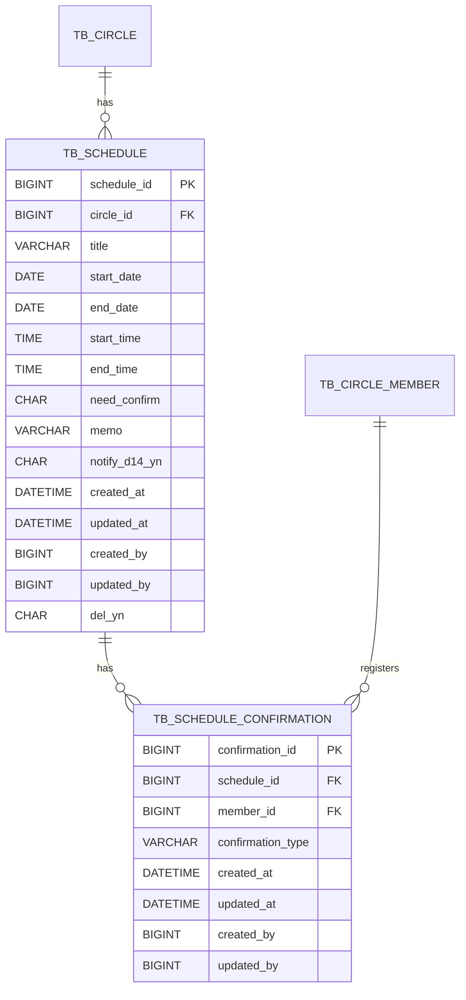

# 일정(Schedule) 도메인 ERD

## 1. 설계 의도

### 일정(Schedule)

- 일정은 써클(Circle)에 종속되는 도메인
- MVP 기준 하나의 일정은 하나의 써클에만 공유
- `TB_SCHEDULE.circle_id → TB_CIRCLE` 물리 FK 사용
- 시작일·종료일, 시작시간·종료시간을 각각 분리하여 저장
- 시간 미입력 시 종일 일정으로 처리 (`start_time = NULL`, `end_time = NULL`)
- `need_confirm` 플래그로 확인하기 기능 활성 여부를 제어

### 일정 확인(Confirmation)

- 써클 구성원이 일정 존재를 확인했음을 나타내는 응답
- `need_confirm = 'Y'`인 일정에서만 사용
- 멤버당 확인하기는 1건만 허용, 재등록 시 UPDATE 처리
- 물리 삭제 방식 사용 (del_yn 없음)

### 일정 알림(Notification)

- 일정 관련 알림 예약 정보 관리
- 실제 발송은 알림 도메인 담당
- Schedule 도메인은 예약 정보만 관리

### MVP 제외 항목

- 참여 상태(참석/불참/미정) → `TB_SCHEDULE_RESPONSE` 미생성

---

## 2. ERD



---

## 3. 테이블 정의

### TB_SCHEDULE

| 컬럼 | 타입 | 설명 |
| --- | --- | --- |
| schedule_id | BIGINT | 일정 ID |
| circle_id | BIGINT | 대상 써클 |
| title | VARCHAR(30) | 일정 제목 |
| start_date | DATE | 시작일 |
| end_date | DATE | 종료일 |
| start_time | TIME | 시작시간 (NULL = 종일 일정) |
| end_time | TIME | 종료시간 (NULL = 종일 일정) |
| need_confirm | CHAR(1) | 확인하기 기능 활성 여부 (Y/N) |
| memo | VARCHAR(500) | 메모 |
| notify_d14_yn | CHAR(1) | D-14 알림 여부 (Y/N) |
| created_at | DATETIME | 생성일시 |
| updated_at | DATETIME | 수정일시 |
| created_by | BIGINT | 등록자 |
| updated_by | BIGINT | 수정자 |
| del_yn | CHAR(1) | 삭제 여부 (Y/N) |

#### 제약사항

- `title` 공백 전용 불가
- `start_date` 과거 허용
- `end_date >= start_date`
- `start_time`, `end_time` 동시에 NULL이거나 동시에 NOT NULL이어야 함 (종일 또는 시간 일정)
- `need_confirm`, `notify_d14_yn`, `del_yn` = `Y` / `N`
- 소프트 삭제 사용

```sql
CREATE TABLE TB_SCHEDULE (
    schedule_id   BIGINT       NOT NULL AUTO_INCREMENT,
    circle_id     BIGINT       NOT NULL,
    title         VARCHAR(30)  NOT NULL,
    start_date    DATE         NOT NULL,
    end_date      DATE         NOT NULL,
    start_time    TIME         NULL,
    end_time      TIME         NULL,
    need_confirm  CHAR(1)      NOT NULL DEFAULT 'N',
    memo          VARCHAR(500) NULL,
    notify_d14_yn CHAR(1)      NOT NULL DEFAULT 'N',
    created_at    DATETIME     NOT NULL,
    updated_at    DATETIME     NOT NULL,
    created_by    BIGINT       NOT NULL,
    updated_by    BIGINT       NOT NULL,
    del_yn        CHAR(1)      NOT NULL DEFAULT 'N',
    PRIMARY KEY (schedule_id),
    CONSTRAINT fk_schedule_circle FOREIGN KEY (circle_id) REFERENCES TB_CIRCLE (circle_id)
);
```

---

### TB_SCHEDULE_CONFIRMATION

| 컬럼 | 타입 | 설명 |
| --- | --- | --- |
| confirmation_id | BIGINT | 확인하기 ID |
| schedule_id | BIGINT | 일정 ID |
| member_id | BIGINT | 확인한 멤버 |
| confirmation_type | VARCHAR(30) | 확인하기 종류 (ConfirmationType enum) |
| created_at | DATETIME | 생성일시 |
| updated_at | DATETIME | 수정일시 |
| created_by | BIGINT | 등록자 |
| updated_by | BIGINT | 수정자 |

#### UNIQUE

```sql
UNIQUE KEY uq_schedule_member (schedule_id, member_id)
```

#### 설명

- 일정당 멤버 확인하기는 1건만 허용
- 재등록 시 UPDATE 처리 (confirmation_type 변경)
- `del_yn` 없음 — 취소 시 Row 물리 삭제

```sql
CREATE TABLE TB_SCHEDULE_CONFIRMATION (
    confirmation_id   BIGINT      NOT NULL AUTO_INCREMENT,
    schedule_id       BIGINT      NOT NULL,
    member_id         BIGINT      NOT NULL,
    confirmation_type VARCHAR(30) NOT NULL,
    created_at        DATETIME    NOT NULL,
    updated_at        DATETIME    NOT NULL,
    created_by        BIGINT      NOT NULL,
    updated_by        BIGINT      NOT NULL,
    PRIMARY KEY (confirmation_id),
    UNIQUE KEY uq_schedule_member (schedule_id, member_id),
    CONSTRAINT fk_confirmation_schedule FOREIGN KEY (schedule_id) REFERENCES TB_SCHEDULE (schedule_id),
    CONSTRAINT fk_confirmation_member   FOREIGN KEY (member_id)   REFERENCES TB_CIRCLE_MEMBER (member_id)
);
```

---

## 4. 코드 정의

### ConfirmationType (확인하기 종류)

| 코드 | 설명 |
| --- | --- |
| CONFIRMED | (placeholder — 실제 값 추후 확정) |

#### 참고

- 미확인은 Row 없음으로 판단
- `need_confirm = 'N'`인 일정에는 Row를 생성하지 않는다

---

### Notification Status

| 코드 | 의미 |
| --- | --- |
| PENDING | 발송 대기 |
| SENT | 발송 완료 |
| CANCELLED | 발송 취소 |

---

## 5. 비즈니스 규칙

### 일정 생성

- 등록자가 생성자(`created_by`)가 됨
- 생성 시 알림 예약 자동 생성 (알림 도메인 위임)

### 일정 수정

아래 항목 중 하나라도 변경되면:

- `title`
- `start_date`
- `end_date`
- `start_time`
- `end_time`

→ 써클 전체에 일정 변경 알림 발송  
→ 미발송 알림 예약 재계산

### 일정 삭제

- `TB_SCHEDULE.del_yn = 'Y'`
- `TB_SCHEDULE_CONFIRMATION` Row 물리 삭제
- 연결된 알림 예약(PENDING) → CANCELLED

### 확인하기 등록

- `need_confirm = 'N'`인 일정에는 등록 불가
- 멤버당 1개 Row만 허용
- 동일 종류 재등록 시 변경 없음 (멱등)
- 다른 종류 재등록 시 기존 Row UPDATE

### 확인하기 현황 (상세 조회 시)

- 각 ConfirmationType별 count 집계
- 조회 멤버의 본인 확인하기 종류 표시
- 미확인 멤버는 Row 없음으로 판단

---

## 6. FK 관계

| FK | 유형 |
| --- | --- |
| `TB_SCHEDULE.circle_id → TB_CIRCLE` | 물리 FK |
| `TB_SCHEDULE_CONFIRMATION.schedule_id → TB_SCHEDULE` | 물리 FK |
| `TB_SCHEDULE_CONFIRMATION.member_id → TB_CIRCLE_MEMBER` | 물리 FK |
| `created_by` / `updated_by → TB_USER` | 논리 참조 |

---

## 7. 미결 사항

| 항목 | 현재 처리 |
| --- | --- |
| ConfirmationType 실제 값 확정 | placeholder `CONFIRMED` 단일 값 사용 중 |
| 확인하기 취소 지원 여부 | Row 물리 삭제로 처리 예정, 별도 API 미설계 |
| 써클 삭제 시 일정 처리 정책 | 미정 |
| `notify_d14_yn` 외 추가 알림 플래그 여부 | 알림 도메인 정책에서 정의 예정 |
| 장소(location) 필드 추가 여부 | 미포함 |
| 참여 상태 체계 도입 시 `TB_SCHEDULE_RESPONSE` 추가 | MVP 이후 검토 |
